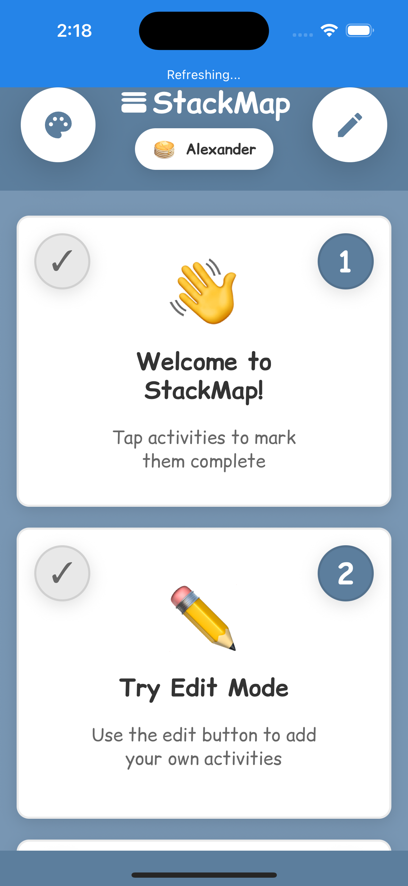
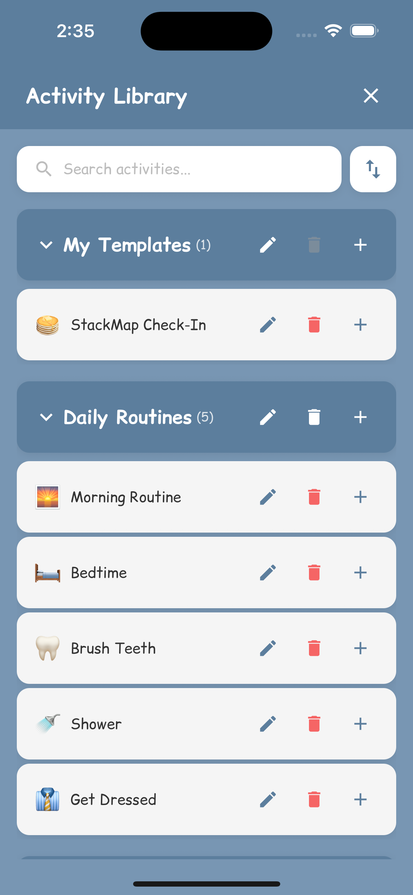
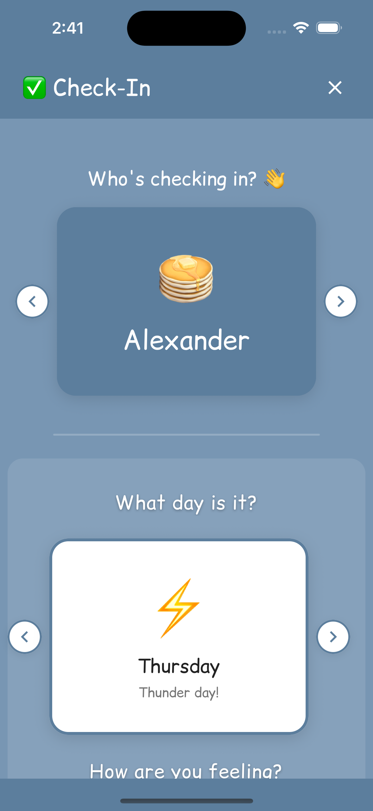
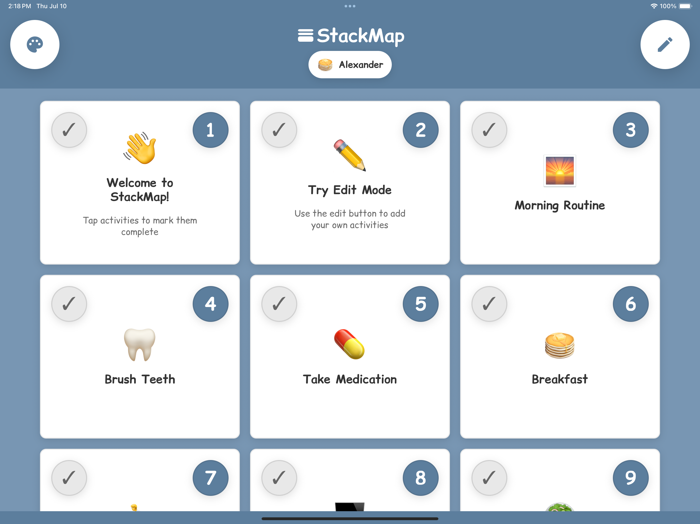
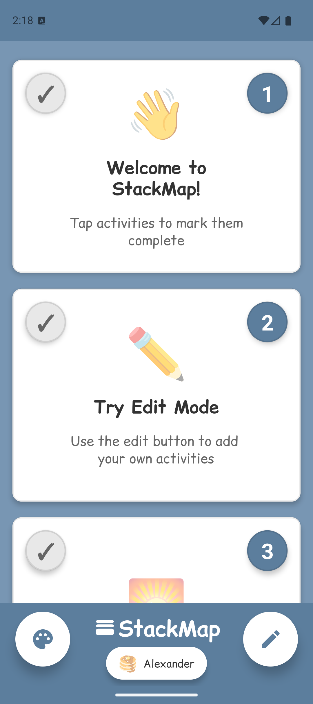

# StackMap 📅

**Better days through shared understanding**

A visual schedule app that helps families, educators, and caregivers create structured daily routines through intuitive activity cards.

<p align="center">
  
  
  
</p>

<p align="center">
  <a href="#-download"></a>
  <a href="LICENSE"></a>
  <a href="#-features"></a>
  <a href="#-security--privacy"></a>
</p>

## 🎯 What is StackMap?

StackMap transforms daily chaos into calm, predictable routines. Designed for individuals with autism, ADHD, and executive function challenges, as well as their families and support teams, StackMap makes it easy to:

- **Create visual schedules** that reduce anxiety about "what comes next"
- **Build independence** through clear, followable routines
- **Track progress** with mood check-ins and activity completion
- **Sync across devices** so everyone stays on the same page

### Who Benefits from StackMap?

- 👨‍👩‍👧‍👦 **Families** managing morning routines, homework time, and bedtime
- 🧩 **Individuals with autism** who thrive with visual structure
- 🎯 **People with ADHD** needing external organization support
- 👩‍🏫 **Teachers & Therapists** creating consistent classroom routines
- 👴👵 **Caregivers** supporting elderly family members

## ✨ Features

### 🎨 Visual Activity Cards
Clear, icon-based activities that make routines easy to understand at a glance
- Timer support for time-based activities
- Progress tracking with satisfying completion states
- Customizable icons and descriptions

### 👥 Multi-User Support
Perfect for families and classrooms
- Personalized color themes for each user
- Individual schedules and preferences
- Quick user switching

### 📚 Rich Activity Library
Get started quickly with pre-built templates
- Common daily routines (morning, bedtime, homework)
- Educational activities
- Self-care and life skills
- Save your own custom activities

### 🔄 Seamless Sync
Stay connected across all devices
- **Zero-knowledge encryption** - your data is encrypted before leaving your device
- Real-time synchronization
- Works offline with automatic sync when reconnected
- Share schedules with family members and caregivers

### 📊 Progress Tracking
Understand patterns and celebrate success
- Mood and weather check-ins
- Activity completion tracking
- Export data for analysis

### ♿ Accessibility First
Designed for everyone
- High contrast interface (no gray text)
- Large touch targets
- Screen reader support
- Consistent Comic Relief font for readability

## 📱 Download

### Mobile Apps
Coming soon to app stores! Currently in beta testing.

### Web App
Try StackMap in your browser (works offline too!):
🌐 **[stackmap.app](https://stackmap.app)**

## 🚀 Getting Started

### For Users
1. Visit [stackmap.app](https://stackmap.app) or download the mobile app
2. Create your first user profile
3. Add activities from the library or create your own
4. Start your day with a clear visual schedule!

### For Developers

#### Prerequisites
- Node.js 18+
- For iOS: Xcode 14+, CocoaPods
- For Android: Java 17, Android Studio
- See [Environment Setup](https://reactnative.dev/docs/set-up-your-environment)

#### Quick Start
```bash
# Clone the repository
git clone https://github.com/yourusername/StackMap.git
cd StackMap

# Install dependencies
npm install

# Web development
npm run web        # Start dev server on http://localhost:3001
npm run build:web  # Build for production

# iOS development
cd ios && pod install && cd ..
npm run ios

# Android development (requires Java 17)
./scripts/react-native/run-android.sh
```

## 🛡️ Security & Privacy

Your data is yours. StackMap uses **zero-knowledge encryption**, meaning:
- Data is encrypted on your device before syncing
- We cannot read your schedules or personal information
- Secure 32-character recovery phrases for sync
- No tracking, no ads, no data selling

Learn more in our [Security Documentation](./docs/sync/README.md).

## 📖 Documentation

### User Guides
- [Getting Started Guide](./docs/onboarding/USER_ONBOARDING.md)
- [Creating Effective Visual Schedules](./docs/features/visual-schedules-guide.md)
- [Sync Setup Guide](./docs/sync/USER_GUIDE.md)

### Developer Documentation
- [Architecture Overview](./docs/architecture/README.md)
- [Cross-Platform Development](./docs/CROSS_PLATFORM_DEVELOPMENT.md)
- [Deployment Guide](./docs/deployment/README.md)
- [Testing Guidelines](./docs/testing/README.md)
- [All Documentation](./docs/)

## 🤝 Contributing

We welcome contributions from the community! StackMap is built by people who understand the importance of routine and structure.

### How to Contribute
1. Read our [Contributing Guide](CONTRIBUTING.md)
2. Check out [open issues](https://github.com/yourusername/StackMap/issues)
3. Fork the repository
4. Create a feature branch
5. Submit a pull request

### Development Setup
```bash
# First time setup
./scripts/native-dev-setup.sh

# Run tests
npm test

# Type checking
npm run typecheck
```

## 🗺️ Roadmap

- [ ] App Store and Google Play release
- [ ] Apple Watch companion app
- [ ] Voice assistant integration
- [ ] Collaborative schedules for teams
- [ ] Analytics dashboard for caregivers
- [ ] Multi-language support

## 💬 Community & Support

- 🐛 [Report Issues](https://github.com/yourusername/StackMap/issues)
- 💡 [Feature Requests](https://github.com/yourusername/StackMap/discussions)
- 📧 [Contact Support](mailto:support@stackmap.app)

## 🏆 Why Choose StackMap?

Unlike generic calendar or todo apps, StackMap is purpose-built for visual learners and those who need structured support:

| Feature | StackMap | Generic Apps |
|---------|----------|--------------|
| Visual-first design | ✅ Built for visual thinkers | ❌ Text-heavy |
| Multi-user support | ✅ Family-friendly | ❌ Single user |
| Accessibility | ✅ Core priority | ❌ Afterthought |
| Privacy | ✅ Zero-knowledge encryption | ❌ Data mining |
| Offline support | ✅ Full functionality | ❌ Limited |
| Customization | ✅ Themes & personalization | ❌ One-size-fits-all |

## 📄 License

This project is licensed under the MIT License - see the [LICENSE](LICENSE) file for details.

## 🙏 Acknowledgments

StackMap is built with love for visual learners everywhere. Special thanks to:
- The autism and ADHD communities for invaluable feedback
- Educators and therapists who helped shape our features
- The React Native community for excellent tools
- Every family using StackMap to create better days

---

<p align="center">
  <strong>Built for families. Designed for clarity. Made with 💜</strong>
  <br>
  <br>
  
  
</p>

<p align="center">
  <sub>Creating better days through shared understanding</sub>
</p>