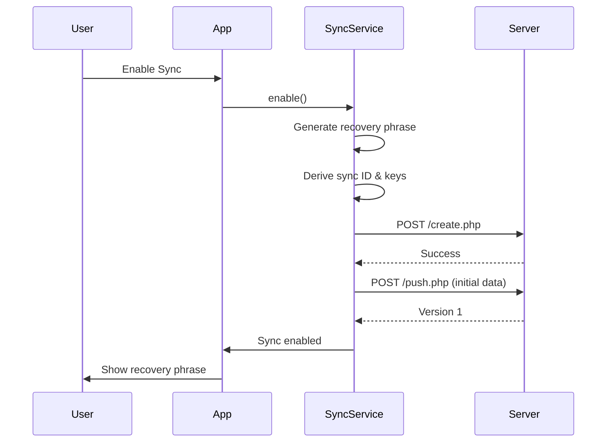
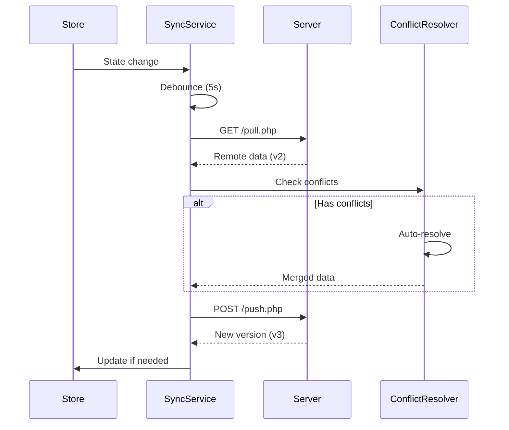

# StackMap Sync Architecture Documentation

## Table of Contents
1. [Overview](#overview)
2. [System Architecture](#system-architecture)
3. [Sync Flow Diagrams](#sync-flow-diagrams)
4. [Key Components](#key-components)
5. [Data Flow](#data-flow)
6. [Conflict Resolution](#conflict-resolution)
7. [Potential Issues & Mitigations](#potential-issues--mitigations)
8. [API Reference](#api-reference)

## Overview

StackMap's sync system provides end-to-end encrypted synchronization across devices using:
- Client-side encryption with TweetNaCl
- Recovery phrase-based authentication
- Automatic conflict resolution
- Offline-first architecture with queue management
- Real-time sync with debouncing

## System Architecture

```
┌─────────────────┐     ┌─────────────────┐     ┌─────────────────┐
│   Device A      │     │   Sync Server   │     │   Device B      │
│                 │     │                 │     │                 │
│ ┌─────────────┐ │     │ ┌─────────────┐ │     │ ┌─────────────┐ │
│ │ Zustand     │ │     │ │ MySQL DB    │ │     │ │ Zustand     │ │
│ │ Store       │ │     │ │             │ │     │ │ Store       │ │
│ └──────┬──────┘ │     │ │ sync_data   │ │     │ └──────┬──────┘ │
│        │        │     │ │ sync_devices│ │     │        │        │
│ ┌──────▼──────┐ │     │ │ shares      │ │     │ ┌──────▼──────┐ │
│ │ SyncService │◄├─────┼►└─────────────┘◄├─────┼►│ SyncService │ │
│ └──────┬──────┘ │     │                 │     │ └──────┬──────┘ │
│        │        │     │                 │     │        │        │
│ ┌──────▼──────┐ │     │                 │     │ ┌──────▼──────┐ │
│ │ Encryption  │ │     │                 │     │ │ Encryption  │ │
│ │ Service     │ │     │                 │     │ │ Service     │ │
│ └─────────────┘ │     │                 │     │ └─────────────┘ │
└─────────────────┘     └─────────────────┘     └─────────────────┘
```

## Sync Flow Diagrams

### Initial Sync Setup


### Automatic Sync Flow


## Key Components

### 1. SyncService (`/src/services/sync/syncService.js`)

**Core Responsibilities:**
- Manages sync lifecycle
- Handles push/pull operations
- Maintains sync state
- Orchestrates other services

**Key Methods:**
```javascript
// Initialization
async enable(existingRecoveryPhrase = null)
async disable()

// Sync Operations
async push(retryCount = 0)
async pull()
async sync()

// State Management
async verifySyncExists()
isEnabled()
getSyncId()
getRecoveryPhrase()
```

**Sync Triggers:**
1. **Store Changes** - Debounced by 5 seconds
2. **Periodic Timer** - Every 30 seconds
3. **Network Reconnection**
4. **Manual Sync Request**
5. **App Foreground Event**

### 2. EncryptionService (`/src/services/sync/encryptionService.js`)

**Encryption Flow:**
```
Recovery Phrase → PBKDF2 (1000 iterations) → Encryption Key
Data + Key → TweetNaCl secretbox → Encrypted Data
Large Data → Compression → Encryption
```

**Key Security Features:**
- 128-bit recovery phrases
- Device-specific key storage
- Automatic compression for large payloads
- No plaintext data on server

### 3. ConflictResolver (`/src/services/sync/conflictResolver.js`)

**Conflict Resolution Strategies:**

| Data Type | Strategy | Implementation |
|-----------|----------|----------------|
| Arrays | Merge Unique | Combines arrays, removes duplicates |
| Objects | Deep Merge | Field-by-field comparison |
| Users | Smart Merge | Detects duplicates by name+icon |
| Activities | Last Modified | Uses timestamps for resolution |
| Scalars | Last Write Wins | Simple replacement |

**Special User Merge Logic:**
```javascript
// Detects duplicate users
const duplicateUsers = findDuplicateUsers(mergedUsers);

// Merges activities preserving completion states
duplicateUsers.forEach(([keepId, removeId]) => {
  // Merge user data
  // Preserve completion states
  // Update references
});
```

### 4. Supporting Services

**SyncQueue:**
- Manages offline operations
- Handles retry logic
- Prevents duplicate operations

**ChangeTracker:**
- Tracks incremental changes
- Reduces sync payload size
- Identifies actual modifications

**NetworkMonitor:**
- Monitors connectivity
- Triggers sync on reconnection
- Prevents offline sync attempts

**SyncThrottle:**
- Debounces rapid changes
- Batches multiple updates
- Prevents API flooding

## Data Flow

### 1. State Change Detection
```javascript
// Store subscription in syncService
this.storeUnsubscribe = useAppStore.subscribe(
  (state) => {
    if (this.syncEnabled && this.syncId && networkMonitor.isOnline) {
      this.debouncedSync(); // 5-second debounce
    }
  }
);
```

### 2. Data Preparation
```javascript
// In push() method
const dataToSync = {
  users,
  currentUser,
  currentTheme,
  // ... other state
  timestamp: Date.now(),
  deviceId: await encryptionService.getDeviceId(),
};
```

### 3. Encryption & Transmission
```javascript
// Encrypt data
const encryptedData = await encryptionService.encrypt(dataToSync, encryptionKey);

// Send to server
const response = await fetch(`${API_BASE_URL}/push.php`, {
  method: 'POST',
  body: JSON.stringify({
    sync_id: this.syncId,
    encrypted_blob: encryptedData,
    device_id: deviceId,
  }),
});
```

## Conflict Resolution

### Detection Phase
1. Compare local and remote versions
2. Check timestamps
3. Identify changed fields

### Resolution Phase

**Array Conflicts (Activities):**
```javascript
// Merge activities preserving unique items
const mergedActivities = [...localActivities];
remoteActivities.forEach(remoteActivity => {
  if (!mergedActivities.find(a => a.id === remoteActivity.id)) {
    mergedActivities.push(remoteActivity);
  }
});
```

**User Data Conflicts:**
```javascript
// Complex merge preserving completion states
const mergeUserData = (localUser, remoteUser) => {
  // Preserve local completions
  const localCompleted = localUser.days[day].completedActivities || [];
  
  // Merge with remote
  const merged = { ...remoteUser };
  
  // Restore local completions
  merged.days[day].completedActivities = [
    ...new Set([...localCompleted, ...remoteCompleted])
  ];
  
  return merged;
};
```

## Potential Issues & Mitigations

### 1. Duplicate Completions

**Issue:** Same activity completed on multiple devices simultaneously
```javascript
// Current approach
completedActivities = [...new Set([...local, ...remote])]
```

**Risk:** If activity IDs aren't unique enough, duplicates possible

**Mitigation:** 
- Use compound keys: `${activityId}-${timestamp}`
- Add transaction IDs

### 2. Sync Loops

**Issue:** Sync updates trigger more syncs
```javascript
// Store update → Sync → Store update → Sync...
```

**Current Mitigation:**
- 5-second debouncing
- Change detection before sync
- Marking synced state

**Additional Safeguards Needed:**
- Sync transaction IDs
- Better change detection
- Sync operation flags

### 3. Race Conditions

**Issue:** Multiple devices syncing simultaneously

**Current Handling:**
- Version-based conflict detection
- Retry with exponential backoff
- Automatic conflict resolution

**Improvements Needed:**
- Device-based sync ordering
- Sync locks
- Better concurrent handling

### 4. Data Integrity

**Issue:** Partial sync operations

**Current Protection:**
- Atomic server updates
- Client-side validation
- Encryption verification

**Enhancements:**
- Checksums for data integrity
- Rollback capability
- Sync operation logs

## API Reference

### Server Endpoints

**POST /api/sync/create.php**
```json
Request: {
  "recovery_salt": "base64_salt"
}
Response: {
  "sync_id": "hash",
  "message": "Sync group created"
}
```

**POST /api/sync/push.php**
```json
Request: {
  "sync_id": "hash",
  "encrypted_blob": "base64_encrypted_data",
  "device_id": "device_hash"
}
Response: {
  "version": 3,
  "message": "Data synced"
}
```

**GET /api/sync/pull.php**
```
Parameters: ?sync_id=hash&device_id=device_hash
Response: {
  "encrypted_blob": "base64_encrypted_data",
  "version": 3
}
```

**POST /api/sync/delete.php**
```json
Request: {
  "sync_id": "hash",
  "device_id": "device_hash"
}
Response: {
  "message": "Sync data deleted"
}
```

## Best Practices

1. **Always check sync status before operations**
2. **Handle conflicts gracefully**
3. **Preserve user data integrity**
4. **Log sync operations for debugging**
5. **Test with multiple devices**
6. **Monitor for sync loops**
7. **Validate data after sync**

## Future Improvements

1. **Enhanced Conflict UI** - Let users choose resolution
2. **Sync History** - Track sync operations
3. **Selective Sync** - Sync only specific data
4. **Compression** - Reduce bandwidth usage
5. **Offline Queue UI** - Show pending operations
6. **Sync Analytics** - Monitor sync health
7. **Data Validation** - Stronger integrity checks

---

Last Updated: August 2024