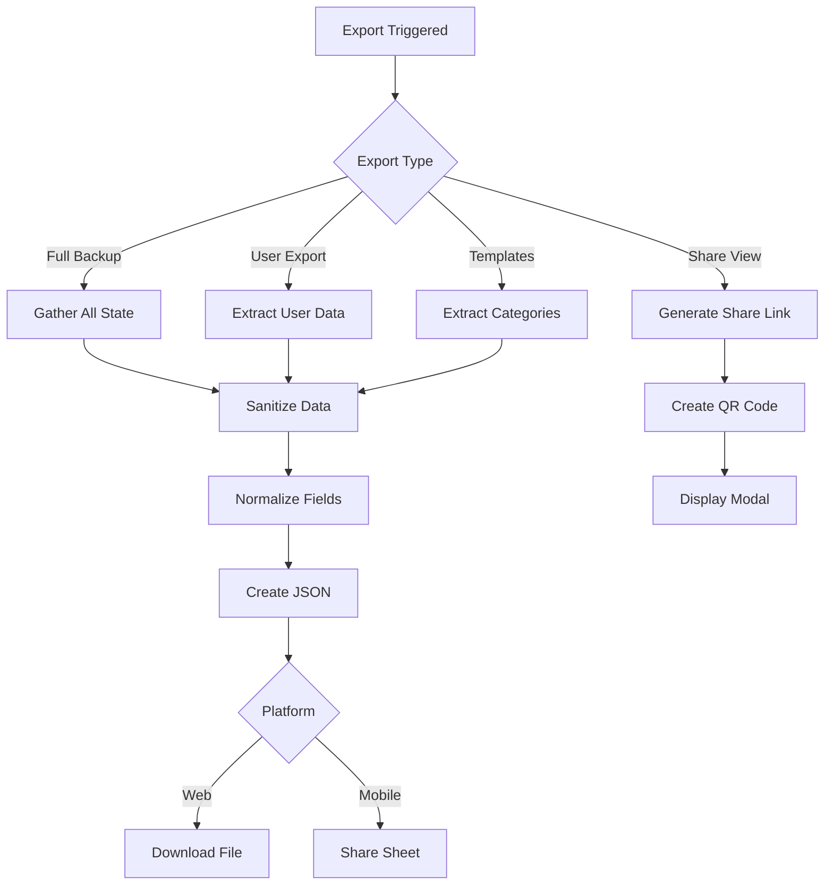

# Data Export Service

## Overview
The export service handles creating backups and sharing data from StackMap in various formats.

## Export Formats

### 1. Full Backup (JSON)
Complete application state for restoration

### 2. User Export (JSON)
Single user with all their data

### 3. Share View (Read-only)
QR codes and links for caregivers

### 4. Activity Templates (JSON)
Library categories for sharing

## Export Flow



## Data Sanitization

### Excluded Fields
Never export these sensitive fields:
```javascript
const EXCLUDED_FIELDS = [
  'pinHash',           // PIN security
  'syncPhrase',        // Only shown explicitly
  'deviceId',          // Device-specific
  'tempImportData',    // Temporary state
  'lastSyncTime',      // Sync metadata
  'syncVersion',       // Internal version
  'encryptionKey',     // Security keys
  'privateKey',        // Encryption keys
  'publicKey'          // Encryption keys
];
```

### Sanitization Process
```javascript
function sanitizeForExport(data) {
  const sanitized = { ...data };
  
  // Remove sensitive fields
  EXCLUDED_FIELDS.forEach(field => {
    delete sanitized[field];
  });
  
  // Remove deleted items
  if (sanitized.users) {
    Object.values(sanitized.users).forEach(user => {
      if (user.deleted) {
        delete sanitized.users[user.id];
      } else {
        // Remove deleted activities
        Object.values(user.days || {}).forEach(day => {
          if (day.activities) {
            day.activities = day.activities.filter(a => !a.deleted);
          }
        });
      }
    });
  }
  
  // Clean up empty objects
  if (sanitized.users && Object.keys(sanitized.users).length === 0) {
    sanitized.users = {};
  }
  
  return sanitized;
}
```

## Export Types

### 1. Full Backup Export
```javascript
function exportFullBackup() {
  const state = getAppState();
  
  const exportData = {
    version: 4,
    exportDate: new Date().toISOString(),
    exportType: 'full_backup',
    
    // User data
    users: sanitizeForExport(state.users),
    currentUser: state.currentUser,
    currentDay: state.currentDay,
    
    // UI settings
    currentTheme: state.currentTheme,
    displayMode: state.displayMode,
    bannerPosition: state.bannerPosition,
    soundEnabled: state.soundEnabled,
    taskCelebration: state.taskCelebration,
    routineCelebration: state.routineCelebration,
    
    // Library data
    library: state.library || { categories: [], userAddedActivityIds: [] },
    libraryTemplates: state.libraryTemplates || [],
    
    // Metadata
    hasCompletedOnboarding: state.hasCompletedOnboarding
  };
  
  return exportData;
}
```

### 2. Single User Export
```javascript
function exportUser(userId) {
  const state = getAppState();
  const user = state.users[userId];
  
  if (!user || user.deleted) {
    throw new Error('User not found or deleted');
  }
  
  const exportData = {
    version: 4,
    exportDate: new Date().toISOString(),
    exportType: 'single_user',
    
    users: {
      [userId]: sanitizeForExport(user)
    },
    currentUser: userId,
    currentDay: state.currentDay,
    
    // Include user's theme preferences
    currentTheme: user.settings?.theme || state.currentTheme
  };
  
  return exportData;
}
```

### 3. Activity Library Export
```javascript
function exportActivityLibrary() {
  const state = getAppState();
  
  const exportData = {
    version: 4,
    exportDate: new Date().toISOString(),
    exportType: 'activity_library',
    
    library: state.library || { categories: [], userAddedActivityIds: [] },
    libraryTemplates: (state.libraryTemplates || []).map(template => ({
      id: category.id,
      name: category.name,
      icon: category.icon,
      activities: category.activities.map(activity => ({
        id: activity.id,
        text: activity.text,
        icon: activity.icon,
        description: activity.description
      }))
    }))
  };
  
  return exportData;
}
```

### 4. Share View Generation
```javascript
function generateShareLink(userId, dayKey = 'today') {
  const shareId = generateShareId();
  const shareData = {
    userId,
    dayKey,
    timestamp: Date.now(),
    expiresAt: Date.now() + (7 * 24 * 60 * 60 * 1000) // 7 days
  };
  
  // Store share data
  storeShareData(shareId, shareData);
  
  // Generate URL
  const baseUrl = getBaseUrl();
  const shareUrl = `${baseUrl}/share/${shareId}`;
  
  return {
    url: shareUrl,
    qrCode: generateQRCode(shareUrl),
    expiresAt: shareData.expiresAt
  };
}
```

## File Generation

### JSON Formatting
```javascript
function formatExportJson(data) {
  // Pretty print for readability
  return JSON.stringify(data, null, 2);
}
```

### File Naming
```javascript
function generateExportFilename(exportType) {
  const date = new Date();
  const dateStr = date.toISOString().split('T')[0]; // YYYY-MM-DD
  const timeStr = date.toTimeString().split(' ')[0].replace(/:/g, '-'); // HH-MM-SS
  
  const names = {
    'full_backup': `stackmap-backup-${dateStr}-${timeStr}.json`,
    'single_user': `stackmap-user-${dateStr}-${timeStr}.json`,
    'activity_library': `stackmap-library-${dateStr}.json`,
    'demo_data': `stackmap-demo-${dateStr}.json`
  };
  
  return names[exportType] || `stackmap-export-${dateStr}.json`;
}
```

## Platform-Specific Export

### Web Platform
```javascript
function downloadFile(data, filename) {
  const json = formatExportJson(data);
  const blob = new Blob([json], { type: 'application/json' });
  const url = URL.createObjectURL(blob);
  
  const link = document.createElement('a');
  link.href = url;
  link.download = filename;
  document.body.appendChild(link);
  link.click();
  document.body.removeChild(link);
  
  URL.revokeObjectURL(url);
}
```

### Mobile Platform (React Native)
```javascript
import Share from 'react-native-share';
import RNFS from 'react-native-fs';

async function shareFile(data, filename) {
  const json = formatExportJson(data);
  const path = `${RNFS.DocumentDirectoryPath}/${filename}`;
  
  // Write file
  await RNFS.writeFile(path, json, 'utf8');
  
  // Share
  await Share.open({
    url: `file://${path}`,
    type: 'application/json',
    title: 'Export StackMap Data'
  });
  
  // Clean up
  await RNFS.unlink(path);
}
```

## Export Validation

### Pre-Export Checks
```javascript
function validateExportData(data) {
  const checks = [
    {
      name: 'Has users',
      test: () => data.users && Object.keys(data.users).length > 0,
      message: 'No users to export'
    },
    {
      name: 'Valid currentUser',
      test: () => data.currentUser && data.users[data.currentUser],
      message: 'Current user is invalid'
    },
    {
      name: 'Has version',
      test: () => data.version !== undefined,
      message: 'Missing version information'
    }
  ];
  
  for (const check of checks) {
    if (!check.test()) {
      throw new Error(check.message);
    }
  }
  
  return true;
}
```

## Compression

### Optional Compression
```javascript
import pako from 'pako';

function compressExport(data) {
  const json = formatExportJson(data);
  const compressed = pako.gzip(json);
  return compressed;
}

function decompressImport(compressed) {
  const json = pako.ungzip(compressed, { to: 'string' });
  return JSON.parse(json);
}
```

## Export Metadata

### Included Metadata
```javascript
{
  "version": 4,                    // Data structure version
  "exportDate": "2024-01-15T10:30:00Z",  // ISO 8601 timestamp
  "exportType": "full_backup",     // Type of export
  "appVersion": "2025.08.14.26",   // App version at export
  "platform": "web",               // Platform (web/ios/android)
  "deviceType": "desktop",         // Device type
  "dataSize": {
    "users": 3,                   // Number of users
    "activities": 45,             // Total activities
    "categories": 8               // Library categories
  }
}
```

## Security Considerations

1. **Data Sanitization** - Remove all sensitive fields
2. **No Encryption Keys** - Never export encryption material
3. **Temporary Files** - Clean up after mobile export
4. **Share Expiration** - Share links expire after 7 days
5. **Access Control** - Verify user owns data before export