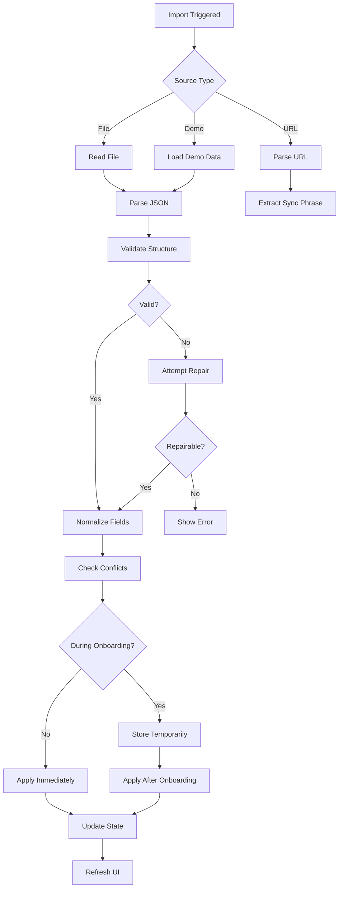

# Data Import Service

## Overview
The import service handles loading external data into StackMap, including demo data, backups, and shared configurations.

## Import Sources

### 1. File Import (JSON)
- User-selected JSON files
- Backup files from export
- Demo data files

### 2. Onboarding Import
- Demo data during setup
- Template configurations
- Starter activity sets

### 3. URL Import
- Sync phrase from URL parameters
- Shared configurations
- Deep links

## Import Flow



## Import Data Validation

### Required Structure
```javascript
{
  "version": 4,              // Required for compatibility check
  "users": {                 // Required, can be empty object
    "[userId]": {
      "id": "string",        // Required
      "name": "string",      // Required, non-empty
      "icon": "emoji",       // Required, single character
      "days": {              // Required
        "[dayKey]": {
          "activities": []   // Required array
        }
      }
    }
  },
  "currentUser": "userId",   // Must reference existing user
  "currentDay": "dayKey",    // Default: "today"
  "activities": [],          // Optional, will be reconstructed
  
  // Optional UI settings
  "currentTheme": "string",
  "displayMode": "string",
  "bannerPosition": "string",
  "soundEnabled": boolean,
  "taskCelebration": "string",
  "routineCelebration": "string",
  
  // Optional library data
  "library": { "categories": [], "userAddedActivityIds": [] },
  "libraryTemplates": [],
  "templates": []
}
```

### Validation Steps
1. **Version Check** - Ensure compatible version
2. **Structure Validation** - Required fields present
3. **Reference Integrity** - IDs reference valid objects
4. **Field Normalization** - Convert deprecated fields
5. **Data Repair** - Fix common issues

## Field Normalization

### Automatic Conversions
```javascript
function normalizeImportData(data) {
  // Normalize each user
  Object.values(data.users || {}).forEach(user => {
    // User icon normalization
    if (user.emoji && !user.icon) {
      user.icon = user.emoji;
      delete user.emoji;
    }
    
    // Ensure required fields
    user.icon = user.icon || '👤';
    user.name = user.name || 'User';
    user.days = user.days || {};
    
    // Normalize activities in each day
    Object.values(user.days).forEach(day => {
      day.activities = (day.activities || []).map(activity => {
        // Activity field normalization
        if (!activity.text) {
          activity.text = activity.name || activity.title || 'Untitled';
          delete activity.name;
          delete activity.title;
        }
        
        if (!activity.icon) {
          activity.icon = activity.emoji || '📌';
          delete activity.emoji;
        }
        
        // Ensure booleans
        activity.completed = !!activity.completed;
        activity.pinned = !!activity.pinned;
        
        return activity;
      });
    });
  });
  
  return data;
}
```

## Import Scenarios

### 1. Clean Import (Empty State)
```javascript
async function importToEmptyState(data) {
  // Normalize
  const normalized = normalizeImportData(data);
  
  // Validate
  if (!validateImportData(normalized)) {
    throw new Error('Invalid import data');
  }
  
  // Apply all data
  applyImportedData(normalized);
  
  // Set UI to show first user
  setCurrentUser(normalized.currentUser || Object.keys(normalized.users)[0]);
  setCurrentDay(normalized.currentDay || 'today');
  
  // Refresh activities view
  updateActivitiesView();
}
```

### 2. Merge Import (Existing Data)
```javascript
async function mergeImportData(importData, existingData) {
  // Generate new IDs to prevent conflicts
  const remappedData = remapIds(importData);
  
  // Merge users (no duplicates by ID)
  const mergedUsers = {
    ...existingData.users,
    ...remappedData.users
  };
  
  // Merge categories (check for duplicates by name)
  const mergedCategories = mergeCategories(
    existingData.library,
    remappedData.library
  );
  
  return {
    ...existingData,
    users: mergedUsers,
    library: mergedLibrary
  };
}
```

### 3. Onboarding Import
```javascript
async function handleOnboardingImport(importData) {
  // Store temporarily during onboarding
  await AsyncStorage.setItem('@stackmap_import_temp', JSON.stringify(importData));
  
  // Will be applied in handleOnboardingComplete
}

function handleOnboardingComplete(onboardingData) {
  // Check for pending import
  const importedDataStr = await AsyncStorage.getItem('@stackmap_import_temp');
  
  if (importedDataStr) {
    const importedData = JSON.parse(importedDataStr);
    
    // Apply imported data
    applyImportedData(importedData);
    
    // Clean up temp storage
    await AsyncStorage.removeItem('@stackmap_import_temp');
    
    // IMPORTANT: Return early to prevent creating default users
    return;
  }
  
  // Continue with normal onboarding...
}
```

## ID Remapping

### Preventing Conflicts
```javascript
function remapIds(data) {
  const idMap = {};
  const timestamp = Date.now();
  
  // Remap user IDs
  const remappedUsers = {};
  Object.entries(data.users).forEach(([oldId, user], index) => {
    const randomId = Math.random().toString(36).substr(2, 9);
    const newId = `user_${timestamp}_${index}_${randomId}`;
    idMap[oldId] = newId;
    
    remappedUsers[newId] = {
      ...user,
      id: newId,
      days: remapActivityIds(user.days, timestamp)
    };
  });
  
  // Update current user reference
  if (data.currentUser && idMap[data.currentUser]) {
    data.currentUser = idMap[data.currentUser];
  }
  
  return {
    ...data,
    users: remappedUsers
  };
}

function remapActivityIds(days, timestamp) {
  const deviceId = getDeviceId();
  
  return Object.entries(days).reduce((acc, [dayKey, dayData]) => {
    acc[dayKey] = {
      ...dayData,
      activities: dayData.activities.map((activity, index) => ({
        ...activity,
        id: `activity_${deviceId}_${timestamp}_${index}_${Math.random().toString(36).substr(2, 9)}`
      }))
    };
    return acc;
  }, {});
}
```

## Error Handling

### Common Issues and Fixes
1. **Missing version** - Assume version 1, apply migrations
2. **Invalid currentUser** - Select first available user
3. **Missing user fields** - Apply defaults (name: 'User', icon: '👤')
4. **Corrupted activities** - Filter out invalid entries
5. **Circular references** - Detect and break cycles

### User Feedback
```javascript
function getImportErrorMessage(error) {
  if (error.message.includes('version')) {
    return 'This file is from an incompatible version of StackMap';
  }
  if (error.message.includes('users')) {
    return 'No valid user data found in file';
  }
  if (error.message.includes('parse')) {
    return 'File is not valid JSON format';
  }
  return 'Unable to import file. Please check the format.';
}
```

## Demo Data

### Structure Requirements
Demo data files must:
1. Use current version format (version: 4)
2. Include at least one user with activities
3. Use `text` and `icon` fields consistently
4. Include variety of completed/uncompleted states
5. Have meaningful descriptions for learning

### Example Demo Data
```json
{
  "version": 4,
  "users": {
    "demo-user-1": {
      "id": "demo-user-1",
      "name": "Atlas",
      "icon": "🗺️",
      "days": {
        "today": {
          "activities": [
            {
              "id": "demo-activity-1",
              "text": "Morning Routine",
              "icon": "☀️",
              "completed": false,
              "pinned": true
            }
          ]
        }
      }
    }
  },
  "currentUser": "demo-user-1",
  "currentDay": "today",
  "currentTheme": "stackBlue"
}
```

## Security Considerations
1. **Sanitize Input** - Remove script tags, validate URLs
2. **Size Limits** - Reject files over 10MB
3. **Rate Limiting** - Prevent rapid import attempts
4. **Validation** - Never trust external data
5. **Sandboxing** - Parse in try/catch blocks