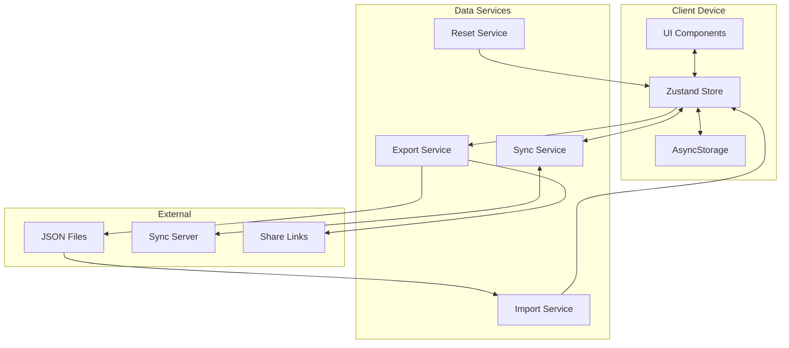

# Data Overview

## Purpose
This document provides a high-level overview of StackMap's data architecture and services. All implementations MUST follow these specifications.

## Core Principles

### 1. Data Consistency
- Single source of truth (Zustand store)
- Normalized field names across all services
- Consistent ID generation patterns
- Validated data at all boundaries

### 2. User Privacy
- Zero-knowledge sync encryption
- No personal data on servers (encrypted only)
- Local-first architecture
- Optional sync (not required)

### 3. Data Integrity
- Soft deletes for sync reconciliation
- Validation at import/export boundaries
- Automatic repair of common issues
- Conflict resolution for concurrent edits

## Architecture Overview



## Service Responsibilities

### Import Service (`data-import-service.md`)
- Validates incoming data structure
- Normalizes deprecated field names
- Handles ID remapping to prevent conflicts
- Manages onboarding data flow
- Repairs common data issues

### Export Service (`data-export-service.md`)
- Sanitizes sensitive data
- Creates platform-appropriate exports
- Generates share links and QR codes
- Formats JSON with proper structure
- Handles compression (optional)

### Sync Service (`data-sync-service.md`)
- Manages zero-knowledge encryption
- Resolves conflicts between devices
- Maintains sync state and polling
- Handles network failures gracefully
- Preserves local completion states

### Reset Service (`data-reset-service.md`)
- Provides graduated reset levels
- Requires appropriate confirmations
- Manages soft deletes for sync
- Handles factory reset safely
- Creates pre-reset backups

## Data Flow Patterns

### 1. Normal Operation
```
User Action → UI Component → Zustand Store → AsyncStorage
                                ↓
                          Update Activities Array
                                ↓
                          Trigger UI Re-render
```

### 2. Import Flow
```
Select File → Parse JSON → Validate → Normalize → Apply to Store
                              ↓            ↓
                         Repair if Needed  Remap IDs
```

### 3. Sync Flow
```
Local Changes → Encrypt → Upload → Server
                            ↓
                     Fetch Remote → Decrypt → Normalize
                            ↓
                     Detect Conflicts → Resolve → Apply
```

### 4. Export Flow
```
Gather State → Sanitize → Format JSON → Platform Export
                   ↓                           ↓
              Remove Sensitive          Download/Share
```

## State Management

### Primary State (Zustand)
```javascript
const useAppStore = create(
  persist(
    (set, get) => ({
      // User data
      users: {},
      currentUser: null,
      currentDay: 'today',
      activities: [],
      
      // UI settings
      currentTheme: 'stackBlue',
      displayMode: 'grid',
      
      // Actions
      setUsers: (users) => set({ users }),
      setActivities: (activities) => set({ activities }),
      // ... more actions
    }),
    {
      name: 'stackmap-storage',
      storage: AsyncStorage
    }
  )
);
```

### State Synchronization
1. **Denormalized Activities**: Top-level `activities` array mirrors current user/day
2. **User Days**: Canonical storage in `users[userId].days[dayKey].activities`
3. **Bidirectional Sync**: Changes to either location update both
4. **Performance**: Denormalized array prevents deep object access

## Field Normalization

### Standard Field Names (Current)
- User: `id`, `name`, `icon`, `days`
- Activity: `id`, `text`, `icon`, `completed`, `pinned`

### Deprecated Fields (Auto-converted)
- User: `emoji` → `icon`
- Activity: `name`/`title` → `text`, `emoji` → `icon`

### Normalization Points
1. **Import**: All imported data normalized
2. **Sync**: Remote data normalized before merge
3. **Migration**: Old app versions upgraded
4. **Export**: Clean, normalized output

## ID Generation Strategy

### Requirements
- Globally unique across all devices
- Collision-resistant even with same timestamp
- Readable format for debugging

### Format
```
Users:      user_${timestamp}_${index}_${randomId}
Activities: activity_${deviceId}_${timestamp}_${randomId}
```

### Components
- `timestamp`: Date.now() for rough ordering
- `index`: Sequential for batch operations
- `deviceId`: Unique per device (stored)
- `randomId`: 9-char random string

## Validation Strategy

### Validation Levels
1. **Structure**: Required fields present
2. **Types**: Correct data types
3. **References**: IDs point to valid objects
4. **Integrity**: No orphaned data
5. **Consistency**: Normalized fields

### Validation Points
- Import boundary (strict)
- Sync merge (repair attempts)
- Export preparation (sanitization)
- State updates (development only)

## Error Recovery

### Automatic Repairs
1. Missing required fields → Add defaults
2. Invalid references → Find valid alternative
3. Corrupted activities → Filter out
4. Missing user.days → Create empty
5. Deprecated fields → Convert to current

### Manual Recovery
1. Factory reset option
2. Import previous backup
3. Disconnect from bad sync
4. Delete corrupted user
5. Clear specific day

## Security Model

### Local Security
- Optional PIN protection
- Secure storage for PIN (Keychain/Keystore)
- No sensitive data in regular storage

### Sync Security
- End-to-end encryption (TweetNaCl)
- 32-character hex sync phrase
- Zero-knowledge server
- No account or email required

### Export Security
- Sanitized exports (no keys/PINs)
- Share links expire (7 days)
- Read-only share views
- No sensitive metadata

## Performance Considerations

### Optimization Strategies
1. **Denormalized Data**: Fast access to current activities
2. **Debounced Saves**: Batch state changes
3. **Lazy Loading**: Load days as needed
4. **Shallow Compares**: React.memo on components
5. **Selective Sync**: Only sync changed data

### Limits
- Max users: 100 (practical limit)
- Max activities per day: 1000
- Max file size: 10MB
- Sync interval: 30 seconds minimum
- Share link expiry: 7 days

## Migration Path

### Version History
- **v1**: Original format (emoji fields)
- **v2**: Added multi-user support
- **v3**: Deprecated (templates/activityCategories)
- **v4**: Current (library structure, clean IDs)

### Future Considerations
- Differential sync for large datasets
- Compressed sync blobs
- Offline-first sync queue
- Activity templates marketplace
- Collaborative shared lists

## Testing Requirements

### Data Service Tests
1. Import validation and repair
2. Export sanitization completeness
3. Sync conflict resolution
4. Reset confirmation flows
5. ID uniqueness verification

### Integration Tests
1. Import → Edit → Export cycle
2. Sync → Conflict → Resolution
3. Reset → Restore from backup
4. Onboarding → Import → Complete
5. Share → View → Import

## Documentation Files

1. **data-dictionary.md** - Canonical data structures
2. **data-sync-service.md** - Synchronization details
3. **data-import-service.md** - Import procedures
4. **data-export-service.md** - Export procedures
5. **data-reset-service.md** - Reset operations
6. **data-overview.md** - This file

## Implementation Checklist

When implementing data features:
- [ ] Follow data dictionary structures exactly
- [ ] Normalize fields at boundaries
- [ ] Validate before state mutations
- [ ] Handle errors with user feedback
- [ ] Test with edge cases
- [ ] Document any deviations
- [ ] Update relevant service docs