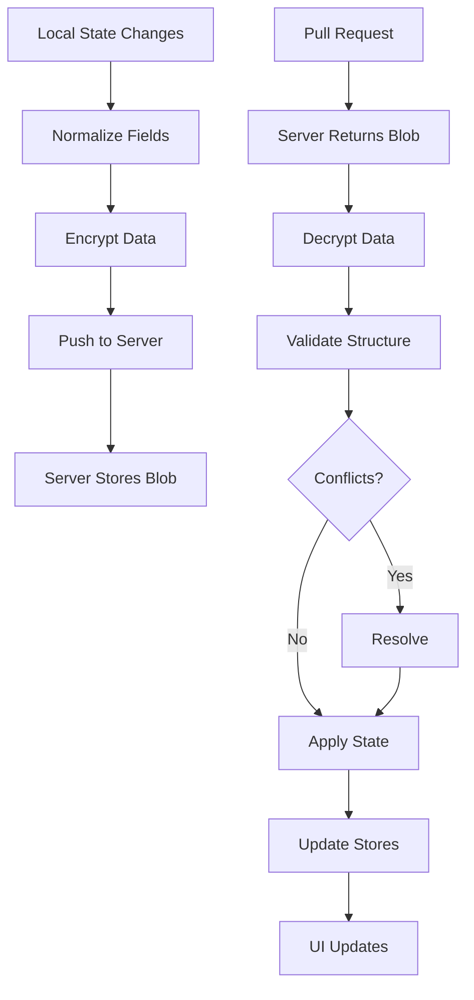

# Data Sync Service

## Overview
The sync service provides zero-knowledge, encrypted synchronization across devices using a shared recovery phrase.

## Complete Data Flow

### 📤 Client → Server (Push)
1. **Gather Data** from 4 stores:
   - `useUserStore`: All users and their activities
   - `useLibraryStore`: Activity templates and categories
   - `useSettingsStore`: Global settings and preferences
   - `useAppStore`: Current user/day selection

2. **Normalize Fields** (`dataNormalizer.js`):
   - Activities: `text` (not name/title), `icon` (not emoji)
   - Users: Ensure `icon` field exists
   - Remove redundant fields

3. **Encrypt** (`encryptionService.js`):
   - Derive key: `PBKDF2(recoveryPhrase + fixedSalt)`
   - Generate nonce: 24 random bytes
   - Encrypt: `nacl.secretbox(data, nonce, key)`
   - Package: `base64(nonce + encryptedData)`

4. **Send** to server:
   - POST to `/api/sync/push.php`
   - Include: sync_id, encrypted_blob, version, metadata
   - Server stores encrypted blob (can't decrypt)

### 📥 Server → Client (Pull)
1. **Request** from server:
   - GET `/api/sync/pull.php?sync_id=xxx`
   - Receive: encrypted_blob, version, metadata

2. **Decrypt** (`encryptionService.js`):
   - Extract nonce: First 24 bytes
   - Derive same key with recovery phrase
   - Decrypt: `nacl.secretbox.open(data, nonce, key)`

3. **Validate** (`dataValidator.js`):
   - Check required fields exist
   - Repair missing data (add defaults)
   - Ensure v4 structure compliance

4. **Resolve Conflicts** (`conflictResolver.js`):
   - Strategy: Last-write-wins with field merging
   - Users: Keep most recent by `lastActive`
   - Activities: Merge arrays, dedupe by ID
   - Settings: Take most recent change

5. **Update Stores**:
   - Split data back to appropriate stores
   - Trigger UI updates via store subscriptions

## Architecture

### Components
1. **syncService.js** - Main sync orchestration (complex architecture with queue, throttling, and network monitoring)
2. **conflictResolver.js** - Handles merge conflicts
3. **dataValidator.js** - Validates sync data integrity
4. **dataNormalizer.js** - Normalizes field names
5. **encryptionService.js** - TweetNaCl encryption/decryption
6. **syncQueue.js** - Manages sync queue for offline support
7. **networkMonitor.js** - Monitors network status
8. **changeTracker.js** - Tracks local changes for incremental sync
9. **syncThrottle.js** - Throttles sync requests
10. **syncHistory.js** - Maintains sync history for debugging

### Sync Flow



## Sync Phrase Format
- **Length**: 32 characters
- **Character Set**: Hexadecimal (0-9, a-f)
- **Format**: Lowercase, no spaces or separators
- **Example**: `a3f8d9c2b1e7f5a9d3c8b2e1f7a5d9c3`

## Data Operations

### 1. Creating a Sync
```javascript
// Generate sync phrase
const syncPhrase = generateSyncPhrase(); // 32 char hex

// Gather data from stores
const syncData = {
  users: useUserStore.getState().users,
  library: useLibraryStore.getState().library,
  globalSettings: useSettingsStore.getState(),
  currentUser: useAppStore.getState().currentUser,
  currentDay: useAppStore.getState().currentDay,
  version: Date.now(), // For conflict detection
  deviceId: getDeviceId()
};

// Normalize fields (fix text/name, icon/emoji)
const normalizedData = dataNormalizer.normalize(syncData);

// Encrypt with NaCl
const masterKey = await deriveKey(syncPhrase);
const nonce = randomBytes(24);
const encrypted = nacl.secretbox(
  JSON.stringify(normalizedData),
  nonce,
  masterKey
);
const blob = base64(concat(nonce, encrypted));

// Upload to server
await fetch('/api/sync/push.php', {
  method: 'POST',
  body: JSON.stringify({
    sync_id: sha256(syncPhrase),
    encrypted_blob: blob,
    version: syncData.version
  })
});
```

### 2. Joining a Sync
```javascript
// Fetch encrypted data
const encrypted = await fetchFromServer(syncPhrase);

// Decrypt
const remoteData = await decryptData(encrypted, syncPhrase);

// Normalize remote data
const normalized = normalizeSyncData(remoteData);

// Validate
if (!validateSyncedData(normalized)) {
  const repaired = repairSyncedData(normalized);
  if (!validateSyncedData(repaired)) {
    throw new Error('Invalid sync data');
  }
  normalized = repaired;
}

// Merge with local
const merged = await mergeData(localState, normalized);

// Apply state
applyState(merged);
```

### 3. Continuous Sync
```javascript
// Poll for changes every 30 seconds when active
const SYNC_INTERVAL = 30000;

// Check for changes
if (hasLocalChanges() || await hasRemoteChanges()) {
  await performSync();
}
```

## Conflict Resolution

### Resolution Strategies
1. **Last Write Wins** - For scalar values (theme, currentUser, etc.)
2. **Timestamp-Based** - For activity completion states (most recent `completedAt` wins)
3. **Merge** - For arrays (activities, combine unique items)
4. **Custom** - For complex objects (users, special merge logic)

### User Merge Rules
1. **Unique by ID** - Users are identified by their ID, not name/icon
2. **Deletion Handling**:
   - Recent deletion (< 30 seconds) wins
   - Otherwise, active state wins
3. **Activity Preservation**:
   - Local completed states are preserved
   - Remote new activities are added
   - Recent deletions are respected

### Activity Merge Rules
1. **Unique by ID** - Activities identified by ID
2. **Completion State Resolution** - Uses "last action wins" based on timestamps:
   - Compares both `completedAt` and `uncompletedAt` timestamps
   - The most recent timestamp determines the final state
   - If activity is marked complete: Sets `completedAt` and `completedBy`
   - If activity is marked incomplete: Sets `uncompletedAt` and `uncompletedBy`
3. **Timestamp Comparison Logic**:
   - Both have `completedAt`: Most recent `completedAt` wins
   - One has `completedAt`, other has `uncompletedAt`: Most recent timestamp wins
   - No timestamps: Local state preserved (legacy fallback)
4. **Field Cleanup**:
   - When marked complete: Removes `uncompletedAt` and `uncompletedBy`
   - When marked incomplete: Removes `completedAt` and `completedBy`
   - Ensures only one set of timestamps exists at a time
5. **Deletion Priority** - Recent deletions (< 30 seconds) respected
6. **Field Updates** - Latest `modifiedAt` timestamp determines non-completion field values
7. **Completion Tracking Fields**:
   - `completed`: boolean state
   - `completedAt`: Unix timestamp when marked complete
   - `completedBy`: Device ID that marked complete
   - `uncompletedAt`: Unix timestamp when marked incomplete
   - `uncompletedBy`: Device ID that marked incomplete

### Completion State Example
```javascript
// Device A marks activity complete at 10:00 AM
activityOnDeviceA = {
  id: "activity_123",
  completed: true,
  completedAt: 1736879400000,  // 10:00 AM
  completedBy: "deviceA",
  // uncompletedAt and uncompletedBy are removed
}

// Device B marks same activity incomplete at 10:05 AM
activityOnDeviceB = {
  id: "activity_123",
  completed: false,
  uncompletedAt: 1736879700000,  // 10:05 AM
  uncompletedBy: "deviceB",
  // completedAt and completedBy are removed
}

// During sync: Device B's uncompletion (10:05 AM) is newer than Device A's completion (10:00 AM)
// Result: Activity is marked as incomplete on both devices
mergedActivity = {
  id: "activity_123",
  completed: false,
  uncompletedAt: 1736879700000,
  uncompletedBy: "deviceB"
}
```

## Data Normalization

### Field Mappings
Applied during sync to ensure consistency:

```javascript
// User normalization
if (user.emoji && !user.icon) {
  user.icon = user.emoji;
  delete user.emoji;
}

// Activity normalization  
if (activity.name && !activity.text) {
  activity.text = activity.name;
  delete activity.name;
}
if (activity.title && !activity.text) {
  activity.text = activity.title;
  delete activity.title;
}
if (activity.emoji && !activity.icon) {
  activity.icon = activity.emoji;
  delete activity.emoji;
}
```

## State Management

### Required State Updates
After successful sync, update:
1. `users` object with merged users
2. `currentUser` if changed
3. `activities` array for current user/day
4. `lastSyncTime` timestamp
5. Any UI settings that changed

### State Restoration
```javascript
function restoreData(syncData) {
  // Apply all state fields
  Object.keys(syncData).forEach(key => {
    if (key !== 'deviceId' && key !== 'syncVersion') {
      setState(key, syncData[key]);
    }
  });
  
  // Explicitly set activities for current view
  const currentUserData = syncData.users[syncData.currentUser];
  const currentDayData = currentUserData?.days[syncData.currentDay];
  if (currentDayData?.activities) {
    setActivities(currentDayData.activities.filter(a => !a.deleted));
  }
}
```

## Error Handling

### Recovery Strategies
1. **Invalid Data** - Attempt repair, fall back to local state
2. **Network Failure** - Retry with exponential backoff
3. **Decryption Failure** - Verify sync phrase, prompt user
4. **Conflict Resolution Failure** - Log details, fall back to current local state (prevents infinite loops)

### Validation Checks
```javascript
function validateSyncedData(data) {
  // Required fields
  if (!data.users || typeof data.users !== 'object') return false;
  if (!data.currentUser) return false;
  
  // Current user must exist and not be deleted
  const currentUser = data.users[data.currentUser];
  if (!currentUser || currentUser.deleted) return false;
  
  // All users must have required fields
  for (const [_userId, user] of Object.entries(data.users)) {
    if (!user.deleted) { // Skip validation for deleted users
      if (!user.name || typeof user.name !== 'string') return false;
      if (!user.icon && !user.emoji) return false; // Accept emoji for backwards compatibility
      if (!user.days || typeof user.days !== 'object') return false;
    }
  }
  
  return true;
}
```

### Conflict Resolution Error Handling
When conflict resolution fails validation:
1. The error is caught and logged (not thrown)
2. The system falls back to the current local state
3. The sync continues without applying remote changes
4. The next sync attempt will retry conflict resolution
5. This prevents infinite validation loops that could freeze the UI

## Security Considerations
1. **Zero-Knowledge** - Server never sees decrypted data
2. **End-to-End Encryption** - TweetNaCl (NaCl) encryption
3. **No Account Required** - Sync phrase is the only credential
4. **Data Minimization** - Only sync necessary fields
5. **Secure Deletion** - Overwrite sync data on reset

## Performance Optimizations
1. **Debounced Saves** - Batch changes before syncing
2. **Differential Sync** - Only sync changed data (future)
3. **Compression** - Gzip sync blobs (server-side)
4. **Caching** - Cache decrypted data for 5 minutes
5. **Throttling** - Limit sync frequency to prevent abuse