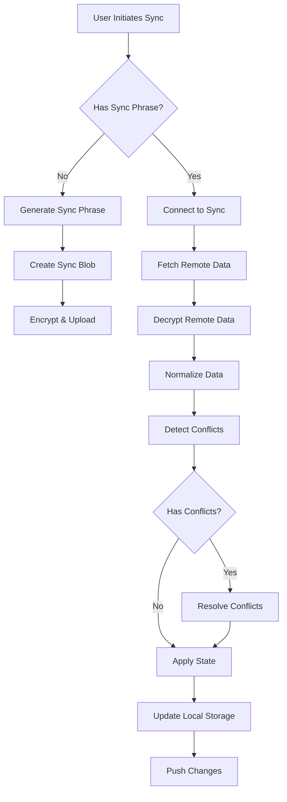

# Data Sync Service

## Overview
The sync service provides zero-knowledge, encrypted synchronization across devices using a shared recovery phrase.

## Architecture

### Components
1. **syncService.js** - Main sync orchestration
2. **conflictResolver.js** - Handles merge conflicts
3. **dataValidator.js** - Validates sync data integrity
4. **dataNormalizer.js** - Normalizes field names
5. **encryptionService.js** - TweetNaCl encryption/decryption

### Sync Flow



## Sync Phrase Format
- **Length**: 32 characters
- **Character Set**: Hexadecimal (0-9, a-f)
- **Format**: Lowercase, no spaces or separators
- **Example**: `a3f8d9c2b1e7f5a9d3c8b2e1f7a5d9c3`

## Data Operations

### 1. Creating a Sync
```javascript
// Generate sync phrase
const syncPhrase = generateSyncPhrase(); // 32 char hex

// Prepare sync data
const syncData = {
  ...currentState,
  deviceId: getDeviceId(),
  syncVersion: 1,
  timestamp: Date.now()
};

// Normalize fields
const normalizedData = normalizeSyncData(syncData);

// Encrypt and upload
const encrypted = await encryptData(normalizedData, syncPhrase);
await uploadToServer(encrypted, syncPhrase);
```

### 2. Joining a Sync
```javascript
// Fetch encrypted data
const encrypted = await fetchFromServer(syncPhrase);

// Decrypt
const remoteData = await decryptData(encrypted, syncPhrase);

// Normalize remote data
const normalized = normalizeSyncData(remoteData);

// Validate
if (!validateSyncedData(normalized)) {
  const repaired = repairSyncedData(normalized);
  if (!validateSyncedData(repaired)) {
    throw new Error('Invalid sync data');
  }
  normalized = repaired;
}

// Merge with local
const merged = await mergeData(localState, normalized);

// Apply state
applyState(merged);
```

### 3. Continuous Sync
```javascript
// Poll for changes every 30 seconds when active
const SYNC_INTERVAL = 30000;

// Check for changes
if (hasLocalChanges() || await hasRemoteChanges()) {
  await performSync();
}
```

## Conflict Resolution

### Resolution Strategies
1. **Last Write Wins** - For scalar values (theme, currentUser, etc.)
2. **Merge** - For arrays (activities, combine unique items)
3. **Custom** - For complex objects (users, special merge logic)

### User Merge Rules
1. **Unique by ID** - Users are identified by their ID, not name/icon
2. **Deletion Handling**:
   - Recent deletion (< 30 seconds) wins
   - Otherwise, active state wins
3. **Activity Preservation**:
   - Local completed states are preserved
   - Remote new activities are added
   - Recent deletions are respected

### Activity Merge Rules
1. **Unique by ID** - Activities identified by ID
2. **Completed State** - Local completion always preserved
3. **Deletion Priority** - Recent deletions (< 30 seconds) respected
4. **Field Updates** - Latest modified version wins

## Data Normalization

### Field Mappings
Applied during sync to ensure consistency:

```javascript
// User normalization
if (user.emoji && !user.icon) {
  user.icon = user.emoji;
  delete user.emoji;
}

// Activity normalization  
if (activity.name && !activity.text) {
  activity.text = activity.name;
  delete activity.name;
}
if (activity.title && !activity.text) {
  activity.text = activity.title;
  delete activity.title;
}
if (activity.emoji && !activity.icon) {
  activity.icon = activity.emoji;
  delete activity.emoji;
}
```

## State Management

### Required State Updates
After successful sync, update:
1. `users` object with merged users
2. `currentUser` if changed
3. `activities` array for current user/day
4. `lastSyncTime` timestamp
5. Any UI settings that changed

### State Restoration
```javascript
function restoreData(syncData) {
  // Apply all state fields
  Object.keys(syncData).forEach(key => {
    if (key !== 'deviceId' && key !== 'syncVersion') {
      setState(key, syncData[key]);
    }
  });
  
  // Explicitly set activities for current view
  const currentUserData = syncData.users[syncData.currentUser];
  const currentDayData = currentUserData?.days[syncData.currentDay];
  if (currentDayData?.activities) {
    setActivities(currentDayData.activities.filter(a => !a.deleted));
  }
}
```

## Error Handling

### Recovery Strategies
1. **Invalid Data** - Attempt repair, fall back to local state
2. **Network Failure** - Retry with exponential backoff
3. **Decryption Failure** - Verify sync phrase, prompt user
4. **Conflict Resolution Failure** - Log details, fall back to current local state (prevents infinite loops)

### Validation Checks
```javascript
function validateSyncedData(data) {
  // Required fields
  if (!data.users || typeof data.users !== 'object') return false;
  if (!data.currentUser) return false;
  
  // Current user must exist and not be deleted
  const currentUser = data.users[data.currentUser];
  if (!currentUser || currentUser.deleted) return false;
  
  // All users must have required fields
  for (const [userId, user] of Object.entries(data.users)) {
    if (!user.deleted) { // Skip validation for deleted users
      if (!user.name || typeof user.name !== 'string') return false;
      if (!user.icon && !user.emoji) return false; // Accept emoji for backwards compatibility
      if (!user.days || typeof user.days !== 'object') return false;
    }
  }
  
  return true;
}
```

### Conflict Resolution Error Handling
When conflict resolution fails validation:
1. The error is caught and logged (not thrown)
2. The system falls back to the current local state
3. The sync continues without applying remote changes
4. The next sync attempt will retry conflict resolution
5. This prevents infinite validation loops that could freeze the UI

## Security Considerations
1. **Zero-Knowledge** - Server never sees decrypted data
2. **End-to-End Encryption** - TweetNaCl (NaCl) encryption
3. **No Account Required** - Sync phrase is the only credential
4. **Data Minimization** - Only sync necessary fields
5. **Secure Deletion** - Overwrite sync data on reset

## Performance Optimizations
1. **Debounced Saves** - Batch changes before syncing
2. **Differential Sync** - Only sync changed data (future)
3. **Compression** - Gzip sync blobs (server-side)
4. **Caching** - Cache decrypted data for 5 minutes
5. **Throttling** - Limit sync frequency to prevent abuse