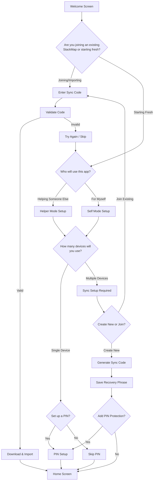

# StackMap Onboarding Workflows & User Journeys

## Current Onboarding Flow

### Path 1: Fresh Session
```
Welcome Screen → Create User → Another User? → PIN Setup? → How to Use → Home
```

### Path 2: Restore StackMap
```
Welcome Screen → Restore → Enter Sync Code → Download Data → Home
```

### Path 3: Sync StackMap
```
Welcome Screen → Sync → Web Redirect → Setup on Web → Return with Code → Home
```

## Proposed Guided Onboarding Flow

### Core Philosophy
- Slow down the process to reduce overwhelm
- Guide users to the right configuration based on their needs
- Make sync discovery natural, not hidden
- Ensure proper user type setup (helper vs self-user)

### New Decision Tree



## Detailed Flow Descriptions

### 1. Initial Decision: Join or Start Fresh

**Screen: Welcome**
- Title: "Welcome to StackMap"
- Subtitle: "Let's get you set up"
- Options:
  - "I have a sync code" → Join existing
  - "I'm starting fresh" → New setup

**Rationale**: Immediately identifies returning vs new users

### 2. User Type Selection

**Screen: Who's This For?**
- Title: "Who will use this app?"
- Options:
  - "I'm helping someone else" → Helper mode
  - "It's for me" → Self mode

**Configuration Impact**:
- Helper Mode:
  - Multiple users likely
  - PIN more important
  - Clear user switching
  - Simplified UI options
  
- Self Mode:
  - Single user likely
  - PIN optional
  - Full feature access
  - Advanced options visible

### 3. Device Strategy

**Screen: Device Setup**
- Title: "How will you use StackMap?"
- Options:
  - "Only on this device" → No sync needed
  - "On multiple devices" → Sync required

**Benefits**:
- Single device users skip sync complexity
- Multi-device users get sync from the start
- No hidden features

### 4. Sync Setup (Multi-device Path)

**Screen: Sync Setup**
- Title: "Keep your data synchronized"
- Explanation: "Your data stays private with end-to-end encryption"
- Options:
  - "Create new sync" → Generate code
  - "Join existing sync" → Enter code

**Native Implementation** (iOS/Android):
- Generate sync code directly in app
- Display recovery phrase prominently
- Require confirmation of saved phrase
- Optional: Email/screenshot reminder

### 5. PIN Protection

**Screen: Security Setup**
- Title: "Protect your StackMap"
- Context-aware messaging:
  - Helper mode: "Prevent accidental changes"
  - Self mode: "Keep your data private"
- Options:
  - "Set up PIN" → PIN entry
  - "Skip for now" → Can add later

## User Journey Maps

### Journey 1: Parent Setting Up for Child

1. **Entry**: Opens app for first time
2. **Decision**: "Starting fresh"
3. **User Type**: "Helping someone else"
4. **Devices**: "Multiple devices" (phone + tablet)
5. **Sync**: Creates new sync
6. **Security**: Sets PIN
7. **Result**: Ready with sync + protection

### Journey 2: Adult for Personal Use

1. **Entry**: Opens app
2. **Decision**: "Starting fresh"
3. **User Type**: "For myself"
4. **Devices**: "Only this device"
5. **Security**: Skips PIN
6. **Result**: Simple, single-device setup

### Journey 3: Therapist Joining Family Sync

1. **Entry**: Opens app
2. **Decision**: "I have a sync code"
3. **Code Entry**: Enters family's code
4. **Import**: Downloads existing data
5. **Security**: Adds their own PIN
6. **Result**: Connected to family's StackMap

### Journey 4: Family Member Adding Device

1. **Entry**: Has StackMap on phone, adding tablet
2. **Decision**: "I have a sync code"
3. **Code Entry**: Uses existing recovery phrase
4. **Import**: Syncs all data
5. **Result**: Multi-device access

## Implementation Considerations

### Platform Differences

**Web Version**:
- Keep "Buy Me a Coffee" link
- Full sync creation capability
- Export/import options
- Advanced settings

**Mobile Versions** (iOS/Android):
- Native sync creation (NEW)
- No donation links
- Simplified UI
- Focus on core functionality

### Sync Discovery Strategy

**Current Issues**:
- Sync hidden in settings
- Users don't discover it
- Requires web redirect

**Proposed Solution**:
- Sync offered during onboarding
- Native implementation on all platforms
- Clear value proposition
- Optional but encouraged

### Simplification Opportunities

1. **Merge Similar Paths**:
   - "Restore" and "Sync" are conceptually similar
   - Could be unified as "Use existing StackMap"

2. **Progressive Disclosure**:
   - Start with essential choices
   - Add complexity only when needed
   - Settings can be changed later

3. **Smart Defaults**:
   - Helper mode → Suggest PIN
   - Multiple devices → Require sync
   - Single device → Skip sync

## Success Metrics

### Onboarding Completion
- Target: 90% complete onboarding
- Measure: Steps completed vs abandoned

### Sync Adoption
- Current: Unknown (hidden feature)
- Target: 60% of multi-device users
- Measure: Sync codes generated

### Time to First Value
- Current: ~3-5 minutes
- Target: <2 minutes
- Measure: Time to home screen

### User Confidence
- Reduce "back" button usage
- Decrease support questions
- Increase feature discovery

## A/B Testing Opportunities

### Test 1: Sync Placement
- A: Current (hidden in settings)
- B: Offered during onboarding
- Measure: Sync adoption rate

### Test 2: Decision Order
- A: User type → Device count → Sync
- B: Device count → User type → Sync
- Measure: Completion rate

### Test 3: Language
- A: Technical ("Sync", "Recovery phrase")
- B: Simple ("Share", "Backup code")
- Measure: Understanding & completion

## Next Steps

1. **Validate Assumptions**:
   - User research on decision points
   - Test prototype flows
   - Gather feedback on language

2. **Technical Implementation**:
   - Native sync generation (iOS/Android)
   - Onboarding state management
   - Skip/back navigation

3. **Design Considerations**:
   - Visual progress indicator
   - Clear value propositions
   - Accessible language

4. **Migration Strategy**:
   - Existing users unaffected
   - New onboarding for fresh installs
   - Option to re-onboard in settings