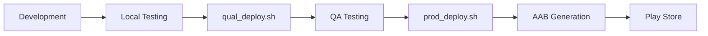

# Android Platform Guide - StackMap

> **Purpose:** This comprehensive guide documents Android-specific development patterns, solutions, and best practices developed for StackMap. It serves both as internal documentation and as a reference implementation for teams adapting these methodologies to other React Native projects.

> **Last Updated:** January 2025 | **Platform:** React Native 0.80.1 | **Min Android:** API 23 (6.0)

## 📋 Table of Contents

1. [Quick Reference](#quick-reference)
2. [Critical Build Setup](#critical-build-setup)
3. [Common Issues & Solutions](#android-specific-issues--solutions)
4. [Architecture Patterns](#architecture-patterns)
5. [Performance Optimization](#performance-optimizations)
6. [Testing Strategy](#testing-strategy)
7. [Deployment Process](#deployment-process)
8. [Troubleshooting Guide](#troubleshooting-guide)
9. [Lessons Learned](#lessons-learned)

---

## Quick Reference

### Development Commands
```bash
# AUTOMATED DEPLOYMENT (Recommended)
./scripts/deploy-android-all.sh  # Full deployment with version increment
./scripts/deploy-android-quick.sh  # Quick reload for minor changes

# Manual commands (if needed)
npx react-native run-android  # Run with Metro
adb devices  # List available devices
cd android && ./gradlew clean && cd ..  # Clean build
cd android && ./gradlew assembleDebug  # Build debug APK
```

### Project Requirements

| Component | Version | Notes |
|-----------|---------|-------|
| React Native | 0.80.1 | Latest stable with new architecture |
| Min Android | API 23 (6.0) | ~98% device coverage |
| Target Android | API 35 | Android 15 |
| Java | 17 | ⚠️ CRITICAL - Java 24 will fail |
| Gradle | 8.8 | With Kotlin DSL support |
| Build Tools | 35.0.0 | Latest stable |

## Project Structure

```
android/
├── app/build.gradle     # compileSdkVersion 34, minSdkVersion 23
├── app/src/main/AndroidManifest.xml  # Permissions
├── build.gradle        # Project-level config
└── gradle.properties   # Build settings
```

## Critical Build Setup

### 🚨 Java 17 Requirement
**CRITICAL:** This app REQUIRES Java 17. Using Java 24 will cause build failures!

```bash
# Quick verification
java -version
# Should show: openjdk version "17.x.x"
```

### Project Configuration (DO NOT CHANGE)
- **Java**: 17 (OpenJDK)
- **Gradle**: 8.8
- **Android Gradle Plugin**: 8.9.2
- **Build Tools**: 35.0.0
- **Compile SDK**: 35
- **Min SDK**: 24
- **Target SDK**: 35

### Build Scripts (Recommended)
Use the provided scripts that force Java 17:
```bash
# To run the app
./scripts/react-native/run-android.sh

# To build APK
./scripts/react-native/build-android.sh assembleRelease

# To clean build
./scripts/react-native/build-android.sh clean
```

### Manual Java 17 Setup (if scripts don't work)
```bash
# Install Java 17 (macOS with Homebrew)
brew install openjdk@17

# Set JAVA_HOME for session
export JAVA_HOME=/opt/homebrew/opt/openjdk@17/libexec/openjdk.jdk/Contents/Home
export PATH=$JAVA_HOME/bin:$PATH

# Verify
java -version  # Should show version 17
```

## Android-Specific Issues & Solutions

> **Key Insight:** Android's rendering engine differs significantly from iOS, requiring platform-specific approaches for layouts, fonts, and gestures. These solutions were discovered through extensive testing across various device configurations.

### 1. FlexWrap Card Layouts (CRITICAL)
**Problem:** Android needs specific layout approach for multi-column grids.
**Solution:** Use percentage widths with alignContent:

```javascript
// ❌ DON'T use calculateCardWidth() on Android
// ✅ DO use percentage widths
flexWrap: 'wrap',
alignContent: 'flex-start',
// Card widths: 48% for 2-column, etc.
```

### 2. Font Weight Differences (CRITICAL)
**Problem:** Android renders fonts differently than iOS.
**Solution:** Use font variants without fontWeight property:

```javascript
// Typography component handles this automatically
// ❌ DON'T do this on Android:
fontWeight: 'bold',
fontFamily: 'Comic Relief'

// ✅ DO this (Typography component handles):
fontWeight: 'bold'  // Component uses ComicRelief-Bold variant
```

**Key Points:**
- iOS/Web: Uses fontWeight with "Comic Relief" font
- Android: Uses font variants (ComicRelief-Bold/Regular) without fontWeight
- Typography component handles this automatically

### 3. Tablet Layout (2-Column Grid)
**Problem:** Activities need responsive grid layout on tablets.
**Solution:** Dynamic column calculation:

```javascript
const isTablet = () => {
  const { width, height } = Dimensions.get('window');
  const aspectRatio = width / height;
  return Math.min(width, height) >= 600 && aspectRatio > 1.2;
};

const numColumns = isTablet() && width >= 768 ? 2 : 1;
```

### 4. Swipe Gesture Sensitivity
**Problem:** Android needs lower thresholds for swipe detection.
**Solution:** Platform-specific thresholds:

```javascript
const swipeThreshold = Platform.OS === 'android' ? screenWidth * 0.1 : screenWidth * 0.2;
const velocityThreshold = Platform.OS === 'android' ? 0.3 : 0.5;
```

### 5. StatusBar Handling
**Problem:** Android needs explicit StatusBar management.
**Solution:** Add StatusBar height compensation:

```javascript
{Platform.OS === 'android' && (
  <View style={{ 
    backgroundColor: theme.primary, 
    height: StatusBar.currentHeight || 24 
  }} />
)}
```

### 6. TextInput Color Issues
**Problem:** TextInput shows white text on white background on some Android devices.
**Solution:** Force black text color in Typography component:

```javascript
// In Typography/index.js TextInput component
style={[
  style,
  { 
    fontFamily,
    ...(Platform.OS === 'android' && { color: '#000000' })
  }
]}
```

### 7. ScrollView Touch Initialization
**Problem:** ScrollView inside modals won't scroll until a touchable element is pressed first.
**Solution:** Add nestedScrollEnabled prop:

```javascript
<ScrollView 
  nestedScrollEnabled={true}
  // other props
>
```

## Build Issues & Fixes

### 1. Java Version Error
**Error:** "Unsupported class file major version 68"
**Cause:** Using Java 24 instead of Java 17
**Fix:** Use provided scripts or manually set JAVA_HOME to Java 17

### 2. Gradle Build Failures
```bash
# Fix most build issues
cd android
./gradlew clean
./gradlew --stop  # Stop Gradle daemon
cd ..
npx react-native run-android
```

### 3. Emulator Not Starting
```bash
# List AVDs
emulator -list-avds

# Start emulator manually
emulator -avd Pixel_8_Pro_API_34

# Cold boot if frozen
emulator -avd Pixel_8_Pro_API_34 -no-snapshot-load
```

### 4. Metro Bundler Issues
```bash
# Reset Metro
npx react-native start --reset-cache

# If port 8081 is in use
npx react-native start --port=8082
```

### 5. ADB Connection Issues
```bash
# Restart ADB
adb kill-server
adb start-server

# Reverse port for Metro
adb reverse tcp:8081 tcp:8081
```

### 6. react-native-reanimated Issues (Legacy)
**Problem:** App crashes due to disabled react-native-reanimated
**Solution:** Libraries were re-enabled with proper build tools:
- NDK and CMake installed
- New architecture enabled
- Proper gradle configuration

## Building for Release

### Debug APK
```bash
cd android
./gradlew assembleDebug
# Output: android/app/build/outputs/apk/debug/app-debug.apk
```

### Release APK
```bash
cd android
./gradlew assembleRelease
# Output: android/app/build/outputs/apk/release/app-release.apk
```

### Bundle for Play Store
```bash
cd android
./gradlew bundleRelease
# Output: android/app/build/outputs/bundle/release/app-release.aab
```

## Architecture Patterns

### Platform Abstraction Strategy

StackMap uses a three-tier approach for handling platform differences:

1. **Component Level:** Platform-specific implementations (e.g., Typography component)
2. **Utility Level:** Platform detection utilities (isTablet, isAndroid)
3. **Style Level:** Platform.select() for conditional styling

#### Example Implementation:
```javascript
// Platform utility (src/constants/index.js)
export const isAndroid = Platform.OS === 'android';
export const isTablet = () => {
  const { width, height } = Dimensions.get('window');
  const aspectRatio = width / height;
  return Math.min(width, height) >= 600 && aspectRatio > 1.2;
};

// Component abstraction (Typography/index.js)
const getFontFamily = (weight) => {
  if (isAndroid) {
    return weight === 'bold' ? 'ComicRelief-Bold' : 'ComicRelief-Regular';
  }
  return 'Comic Relief';
};

// Style abstraction
const styles = StyleSheet.create({
  container: {
    ...Platform.select({
      android: {
        elevation: 4,
        alignContent: 'flex-start'
      },
      ios: {
        shadowOffset: { width: 0, height: 2 },
        shadowOpacity: 0.1
      }
    })
  }
});
```

### State Management Considerations

Android's lifecycle differs from iOS, requiring careful state management:

- **Background State:** Android aggressively kills background apps
- **Memory Pressure:** Lower memory thresholds than iOS
- **Solution:** Persist critical state to AsyncStorage frequently

## Performance Optimizations

### Android-Specific Patterns
- Use `removeClippedSubviews` for large FlatLists
- Set appropriate `windowSize` for FlatLists
- Use `getItemLayout` when possible
- Optimize image sizes and formats

### Memory Management

#### Image Optimization
```javascript
// Android-optimized image loading
<Image
  source={{ uri: imageUrl }}
  resizeMode="contain"
  defaultSource={require('./placeholder.png')} // Android fallback
  fadeDuration={0} // Disable fade on Android for performance
  style={{
    width: 100,
    height: 100,
    resizeMethod: 'resize' // Android-specific optimization
  }}
/>
```

#### Memory Leak Prevention
```javascript
useEffect(() => {
  let mounted = true;
  const subscription = EventEmitter.addListener('event', (data) => {
    if (mounted) {
      // Handle event
    }
  });
  
  return () => {
    mounted = false;
    subscription.remove();
  };
}, []);
```

### Rendering Optimizations

1. **FlatList Performance**
   ```javascript
   <FlatList
     data={data}
     removeClippedSubviews={true} // Critical for Android
     maxToRenderPerBatch={10}
     updateCellsBatchingPeriod={50}
     windowSize={10}
     initialNumToRender={10}
     getItemLayout={(data, index) => ({
       length: ITEM_HEIGHT,
       offset: ITEM_HEIGHT * index,
       index
     })}
   />
   ```

2. **Animation Performance**
   - Use native driver when possible
   - Limit to opacity and transform
   - Avoid animating layout properties
   - Keep animations under 300ms

## Testing Strategy

### Device Matrix

| Device Type | Test Device | API Level | Screen Size | Priority |
|-------------|------------|-----------|-------------|----------|
| Phone | Pixel 8 Pro | 34 | 6.7" | High |
| Tablet | Pixel Tablet | 34 | 10.95" | High |
| Budget Phone | Pixel 4a | 30 | 5.8" | Medium |
| Large Tablet | Galaxy Tab S9 | 34 | 12.4" | Medium |
| Foldable | Galaxy Fold | 33 | 7.6" | Low |

### Critical Test Scenarios

1. **Orientation Changes**
   - Activity persistence during rotation
   - Layout recalculation
   - Modal state preservation

2. **Memory Pressure**
   - Test with limited RAM (2GB devices)
   - Background app restoration
   - Large list scrolling

3. **Network Conditions**
   - Offline mode functionality
   - Slow network (2G/3G)
   - Network switching

4. **Accessibility**
   - TalkBack navigation
   - Font scaling (85% - 200%)
   - High contrast mode

## Deployment Process

### Production Build Pipeline



### Build Configuration

#### Release Signing (android/app/build.gradle)
```gradle
signingConfigs {
    release {
        storeFile file(MYAPP_RELEASE_STORE_FILE)
        storePassword MYAPP_RELEASE_STORE_PASSWORD
        keyAlias MYAPP_RELEASE_KEY_ALIAS
        keyPassword MYAPP_RELEASE_KEY_PASSWORD
    }
}
```

#### ProGuard Rules (android/app/proguard-rules.pro)
```
# React Native
-keep class com.facebook.react.** { *; }
-keep class com.facebook.hermes.** { *; }

# StackMap specific
-keep class com.stackmap.** { *; }
```

### Play Store Deployment

1. **Version Code Management**
   - Format: `YYYYMMDDBB` (e.g., 2025011501)
   - Auto-incremented by deployment scripts

2. **Bundle Generation**
   ```bash
   ./scripts/prod_deploy.sh android
   # Generates: android/app/build/outputs/bundle/release/app-release.aab
   ```

3. **Upload Process**
   - Use Play Console internal testing first
   - Gradual rollout (10% → 50% → 100%)
   - Monitor crash reports and ANRs

## Troubleshooting Guide

### Build Failures

| Error | Cause | Solution |
|-------|-------|----------|
| "Unsupported class file major version 68" | Java 24 instead of 17 | Use `./scripts/react-native/run-android.sh` |
| "Could not find com.android.tools.build:gradle" | Gradle version mismatch | Clean gradle cache: `cd android && ./gradlew clean --refresh-dependencies` |
| "Duplicate class kotlin.collections" | Kotlin version conflict | Update kotlin version in android/build.gradle |
| "AAPT: error: resource not found" | Missing resources | Run `cd android && ./gradlew clean` |
| "Metro bundler not found" | Metro connection issue | Run `adb reverse tcp:8081 tcp:8081` |

### Runtime Issues

| Issue | Symptoms | Fix |
|-------|----------|-----|
| White screen on launch | App loads but shows blank | Check Metro connection, clear cache |
| Crash on rotation | App restarts on orientation change | Add `android:configChanges` to AndroidManifest.xml |
| Keyboard covers input | TextInput hidden by keyboard | Use KeyboardAvoidingView with correct behavior |
| Swipe not working | Gestures unresponsive | Lower velocity threshold to 0.3 |
| Font rendering issues | Wrong font weight/style | Use Typography component consistently |

## Debugging Tools

### Logcat Filtering
```bash
# View StackMap-specific logs
adb logcat | grep -i stackmap

# View React Native logs
adb logcat | grep -i "ReactNativeJS"
```

### React Native Debug Menu
- Press Cmd+M (Mac) or Ctrl+M (Windows/Linux) in emulator
- Options: Reload, Debug, Dev Settings

### Device Testing
```bash
# List devices
adb devices

# Run on specific device
npx react-native run-android --deviceId="emulator-5554"

# Install APK directly
adb install android/app/build/outputs/apk/debug/app-debug.apk
```

## Key Testing Devices

- **Phone**: Pixel 8 Pro (API 34)
- **Tablet**: Pixel Tablet (API 34)
- **Test orientations**: Portrait & landscape
- **API compatibility**: 23+ (Android 6.0+)

## Lessons Learned

### What Works Well

1. **Automated Deployment Scripts**
   - Eliminates Java version issues
   - Consistent builds across team
   - Integrated testing and version management

2. **Typography Component Abstraction**
   - Handles platform differences transparently
   - Consistent font rendering
   - Easy to maintain

3. **Platform-Specific Utilities**
   - Clear separation of concerns
   - Reusable detection logic
   - Testable implementations

### Common Pitfalls to Avoid

1. **Don't Assume iOS Patterns Work**
   - Test every feature on Android
   - Different gesture thresholds needed
   - Layout calculations differ

2. **Avoid Complex Animations**
   - Android performance varies widely
   - Stick to simple opacity/transform
   - Test on low-end devices

3. **Memory Management is Critical**
   - Android kills apps aggressively
   - Persist state frequently
   - Clean up resources properly

### Platform-Specific Gotchas

- FlatList vs DraggableFlatList behavior differences
- Shadow/elevation differences from iOS
- Back button handling with BackHandler
- Keyboard avoiding view differences
- Different animation performance characteristics

### Key Implementation Differences from iOS

| Feature | iOS Approach | Android Approach | Reason |
|---------|--------------|------------------|--------|
| Font Weight | fontWeight + fontFamily | Font variants only | Android font rendering engine |
| Card Layout | calculateCardWidth() | Percentage widths | FlexWrap behavior differences |
| Swipe Detection | 20% threshold | 10% threshold | Touch sensitivity variance |
| StatusBar | Automatic | Manual height compensation | System UI differences |
| Shadows | shadowOffset/shadowOpacity | elevation | Native shadow systems |
| Modal Scrolling | Works immediately | Needs nestedScrollEnabled | Touch event propagation |
| Background State | Preserves longer | Kills quickly | Memory management policies |

## Key Files Reference

- `App.js` - Grid layout and responsive logic
- `src/constants/index.js` - isTablet() utility
- `src/components/Typography/index.js` - Font handling
- Styles files with Platform.OS checks

## Migration Guide for Other Projects

### Adapting This Methodology

If implementing these patterns in another React Native project:

1. **Start with Platform Detection**
   ```javascript
   // Create a constants file
   export const PLATFORM = {
     IS_ANDROID: Platform.OS === 'android',
     IS_IOS: Platform.OS === 'ios',
     IS_TABLET: /* your tablet detection logic */
   };
   ```

2. **Abstract Font Handling Early**
   - Create a Typography component
   - Handle platform differences there
   - Use consistently throughout app

3. **Establish Build Scripts**
   - Force Java 17 in scripts
   - Include automatic testing
   - Version management automation

4. **Test Device Matrix**
   - Minimum: One phone, one tablet
   - Include a low-end device
   - Test orientation changes

5. **Document Platform Differences**
   - Keep a running list of gotchas
   - Document solutions as you find them
   - Share with team regularly

## Testing Checklist

### Pre-Commit Checklist
- [ ] Test on Pixel 8 Pro emulator (phone)
- [ ] Test on Pixel Tablet emulator (tablet)
- [ ] Check portrait and landscape orientations
- [ ] Verify 2-column layout on tablets
- [ ] Test swipe gestures and touch responsiveness
- [ ] Check font rendering (Comic Relief)
- [ ] Verify TextInput color and keyboard behavior
- [ ] Test StatusBar appearance
- [ ] Check card layout alignment (FlexWrap)

## Maintenance Guidelines

### When Updating This Document

1. **Add New Issues**
   - Include error message
   - Document root cause
   - Provide tested solution
   - Add to troubleshooting table

2. **Update Solutions**
   - Test on multiple devices
   - Verify no regressions
   - Update code examples
   - Note React Native version

3. **Deprecate Old Information**
   - Mark as deprecated (don't delete)
   - Note when it changed
   - Provide migration path

### When Fixing Android Issues
1. Test on both phone and tablet emulators
2. Check landscape/portrait orientations
3. Document any platform-specific code added
4. Always use the provided build scripts
5. Verify Java 17 is being used
6. Test APK generation for releases

## Support Resources

### Internal Resources
- **Main Documentation:** `/docs/` directory
- **Deployment Guide:** `/docs/deployment/README.md`
- **Platform Guides:** `/docs/platform/`
- **Testing Guide:** `/docs/testing/simple-testing-guide.md`

### External Resources
- [React Native Docs](https://reactnative.dev/docs/platform-specific-code)
- [Android Developer Guides](https://developer.android.com/guide)
- [React Native Performance](https://reactnative.dev/docs/performance)

### Quick Diagnostics

```bash
# System Check Script
echo "Java Version:" && java -version 2>&1 | head -1
echo "Node Version:" && node -v
echo "NPM Version:" && npm -v
echo "React Native Version:" && npx react-native --version
echo "Android Home:" && echo $ANDROID_HOME
echo "Devices:" && adb devices
```

## Verification Checklist

### Pre-Issue Checklist
Before reporting Android build issues:
- [ ] Ran `./scripts/react-native/run-android.sh` (not `npm run android`)
- [ ] Verified Java 17 with `java -version`
- [ ] Tried `./scripts/react-native/build-android.sh clean`
- [ ] Checked Java 17 path: `/opt/homebrew/opt/openjdk@17`
- [ ] Reviewed this guide's troubleshooting section
- [ ] Tested on clean emulator
- [ ] Checked adb connection with `adb devices`

---

> **Contributing:** Found a new issue or solution? Please update this guide following the maintenance guidelines above. Your discoveries help the entire team and future projects adopting this methodology.

> **Questions?** Check `/docs/` first, then reach out to the team with specific error messages and steps to reproduce.