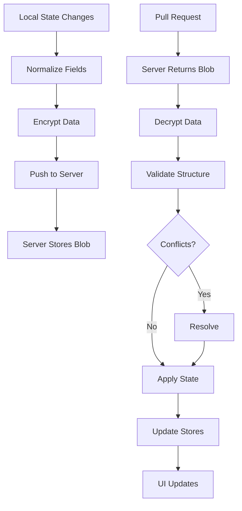

# StackMap Sync System Documentation

**Last Updated: August 2025**

## 🎯 Current Implementation Status (v2025.08.18+)

**StackMap uses the complex sync architecture** - the simplified version was reverted in August 2025 due to AsyncStorage issues.

### Architecture Overview
- **Strategy**: Last-write-wins with timestamp-based conflict resolution (v2025.08.25+)
- **Components**: Full service with queue, throttling, network monitoring (9 supporting modules)
- **Service File**: `/src/services/sync/syncService.js` (~2200 lines)
- **URL Format**: `stackmap.app/?sync=<32-char-hex>`
- **Recovery Phrase**: 32 character hexadecimal (no spaces)
- **Periodic Sync**: 30-second interval when enabled
- **Sync Triggers**: App visibility, data changes (5s debounce), manual, periodic
- **Offline Support**: Queue system for offline changes

## 🔄 Data Flow Summary

### Push (Client → Server)
1. **Gather Data**: From 4 stores (users, library, settings, app state)
2. **Normalize Fields**: Activities use `text` (not name/title) and `icon` (not emoji)
3. **Encrypt**: PBKDF2 key derivation (100k iterations) → NaCl secretbox encryption
4. **Send**: POST encrypted blob with sync_id and version to server
5. **Store**: Server saves encrypted data (zero-knowledge storage)

### Pull (Server → Client)
1. **Request**: GET with sync_id from server
2. **Receive**: Encrypted blob and metadata
3. **Decrypt**: Extract nonce → decrypt with master key
4. **Validate**: Check/repair data structure
5. **Resolve**: Handle conflicts (last-write-wins)
6. **Update**: Split data across 4 specialized stores

## 🔐 Zero-Knowledge Architecture

### Core Principles
- **Server never sees plaintext data**: All data is encrypted client-side before transmission
- **No user accounts**: Authentication based solely on cryptographic proofs
- **No metadata exposure**: Server only stores encrypted blobs with minimal metadata
- **User-controlled**: Complete user control over data lifecycle

### Security Implementation
- **Encryption**: TweetNaCl.js (XSalsa20-Poly1305)
- **Key Derivation**: PBKDF2 with 100,000 iterations
- **Recovery Phrase**: 32-character hexadecimal string (never sent to server)
- **Sync ID**: Derived from recovery phrase using NaCl hash with fixed salt
- **Master Key**: NaCl-hash-derived from recovery phrase + encryption salt
- **Device ID**: Unique identifier for each device
- **Data Expiration**: 6-month automatic cleanup for abandoned data

### Encryption Process
```javascript
// 1. Key Derivation
recoveryPhrase = "32 character hex string"
fixedSalt = "U3RhY2tNYXBTeW5jRW5jcnlwdGlvblNhbHQ=" // Base64
masterKey = PBKDF2(recoveryPhrase + fixedSalt, iterations: 100000)

// 2. Encryption
nonce = randomBytes(24)
encryptedData = nacl.secretbox(JSON.stringify(data), nonce, masterKey)
encryptedBlob = base64(nonce + encryptedData)
```

## 📊 API Reference

### Base URL
```
https://stackmap.app/api/sync
```

### Endpoints

#### 1. Create Sync Group
**POST /create.php**
```json
{
  "sync_id": "string (32 hex characters)",
  "encrypted_blob": "string (base64 encoded)",
  "recovery_salt": "string (base64 encoded)",
  "device_id": "string (32 hex characters)"
}
```

#### 2. Push Data
**POST /push.php**
```json
{
  "sync_id": "string (hash of recovery phrase)",
  "device_id": "string",
  "device_name": "string (optional)",
  "encrypted_blob": "string (base64: nonce + encrypted data)",
  "sync_type": "full",
  "version": "number (timestamp for conflict detection)",
  "metadata": {
    "last_modified": "ISO 8601 timestamp",
    "device_info": "optional device metadata"
  }
}
```

#### 3. Pull Data
**GET /pull.php?sync_id={syncId}&device_id={deviceId}**

Response:
```json
{
  "success": true,
  "encrypted_blob": "string (base64)",
  "version": 2,
  "last_modified": "2024-01-20T12:34:56Z",
  "device_id": "string",
  "device_name": "string"
}
```

#### 4. Delete Sync Data
**POST /delete.php**
```json
{
  "sync_id": "string",
  "device_id": "string"
}
```

#### 5. Health Check
**GET /health.php**

### Data Structure (v4)
```json
{
  "version": 4,
  "syncType": "full",
  "syncTimestamp": 1705761296000,
  "deviceInfo": {
    "id": "device_id",
    "name": "Device Name"
  },
  "currentDay": "today",
  "currentUser": "user_id",
  "users": {
    "user_id": {
      "id": "user_id",
      "name": "User Name",
      "icon": "emoji",
      "days": {
        "today": {
          "activities": [
            {
              "id": "activity_id",
              "text": "Activity",
              "icon": "emoji",
              "completed": false,
              "pinned": false,
              "modifiedAt": 1724601600000
            }
          ]
        }
      },
      "settings": { "theme": "stackBlue" }
    }
  },
  "library": {
    "categories": [],
    "userAddedActivityIds": []
  },
  "globalSettings": {
    "currentTheme": "stackBlue",
    "bannerPosition": "top",
    "pinEnabled": false
  },
  "hasCompletedOnboarding": true
}
```

### Field Normalization Rules
- **Activities**: Use `text` (not name/title), `icon` (not emoji)
- **Users**: `icon` required, `name` as string only
- **Timestamps**: `modifiedAt` field for conflict resolution (defaults to 0)
- **Always include fallbacks**: `activity.text || activity.name || activity.title`

## 🔄 Conflict Resolution (v2025.08.25+)

### Timestamp-Based Resolution
Activities use `modifiedAt` timestamps for conflict resolution during sync:

1. **When timestamps differ**: Higher timestamp wins (most recent edit)
2. **When only one has timestamp**: Timestamped version wins
3. **When neither has timestamp**: Falls back to content comparison
4. **Default value**: Activities without timestamps default to `modifiedAt: 0`

### Activity Operations That Update Timestamps
- **Edit activity**: Sets `modifiedAt: Date.now()`
- **Add from library**: Sets `modifiedAt: Date.now()`
- **Reorder activities**: Updates `modifiedAt` for moved items
- **Toggle completion**: Sets `modifiedAt: Date.now()`
- **Import data**: Activities get `modifiedAt: 0` if missing

### Sync Timing to Prevent Self-Conflicts
- **Debounce**: 10 seconds after last change (increased from 5s)
- **Skip window**: 5 seconds after push (prevents immediate pull-back)
- **Periodic sync**: Every 30 seconds when enabled
- **Merge strategy**: Fresh store data merged with incoming changes

## 🔧 Service Architecture

### Main Components
1. **syncService.js** - Main sync orchestration
2. **encryptionService.js** - TweetNaCl encryption/decryption
3. **conflictResolver.js** - Handles merge conflicts
4. **dataValidator.js** - Validates sync data integrity
5. **dataNormalizer.js** - Normalizes field names
6. **syncQueue.ts** - Manages sync queue for offline support
7. **networkMonitor.js** - Monitors network status
8. **changeTracker.js** - Tracks local changes for incremental sync
9. **syncThrottle.js** - Throttles sync requests
10. **syncHistory.js** - Maintains sync history for debugging

### Sync Flow


### Store Integration
The sync system integrates with 4 specialized stores:
- **useUserStore**: Users and activities
- **useLibraryStore**: Activity templates and categories
- **useSettingsStore**: Global settings and preferences
- **useAppStore**: Current user/day selection

**Critical**: Always use store-specific methods for updates:
```javascript
// CORRECT - updates the specialized user store
useUserStore.getState().setUsers(users);
useSettingsStore.getState().updateSettings(settings);
useLibraryStore.getState().setLibrary(library);

// WRONG - doesn't update underlying stores properly
useAppStore.setState({ users });
```

## 🛠️ Troubleshooting Guide

### Common Issues

#### 1. Activities Not Syncing Between Devices
**Symptoms**: Users sync correctly but activities show as empty
**Causes**: Field naming mismatch, using `name`/`title` instead of `text`
**Solution**: Use correct field names with fallbacks:
```javascript
activity.text || activity.name || activity.title
activity.icon || activity.emoji
```

#### 2. Target Icon (🎯) Appearing Incorrectly
**Symptoms**: Target icon appears when editing activities
**Causes**: Components using `emoji` field instead of `icon`
**Solution**: Always use `icon` field with fallback:
```javascript
setEditEmoji(activity.icon || activity.emoji || '');
```

#### 3. "User missing icon or emoji" Errors
**Symptoms**: Icons present in demo data but missing after sync
**Causes**: Using `useAppStore.setState()` instead of specialized store methods
**Solution**: Use proper store methods for updates:
```javascript
// Fixed to use store-specific methods
const userStore = require('../../stores/useUserStore.js').default;
userStore.getState().setUsers(users);
```

#### 4. Network Suspension After Computer Sleep
**Symptoms**: `net::ERR_NETWORK_IO_SUSPENDED` errors after computer wakes
**Solution**: Automatic retry with exponential backoff:
```javascript
// Retries with delays: 1s, 2s, 4s, max 8s
if (error.message.includes('ERR_NETWORK_IO_SUSPENDED')) {
  const backoffDelay = Math.min(1000 * Math.pow(2, retryCount), 8000);
  await new Promise(resolve => setTimeout(resolve, backoffDelay));
  return this.pullData(retryCount + 1);
}
```

### Debug Commands
```javascript
// Check sync status
syncService.syncEnabled  // Should be true
syncService.syncId       // Should be 32-char hex
syncService.syncStatus   // Should be 'idle' or 'syncing'

// Check data structure
const state = syncService.getCurrentState();
console.log('Sync data valid?', 
  state.users && state.library && state.globalSettings
);

// Force fresh pull
async function debugPull() {
  const data = await syncService.pullData();
  const decrypted = syncService.encryptionService.decryptData(data.encrypted_blob);
  console.log('Server data:', decrypted);
}
```

## 🧪 Testing Procedures

### Manual Test Procedure
1. **Setup Device A**:
   - Clear all data
   - Import demo data (`data/demo-data-kids.json`)
   - Enable sync and copy recovery phrase

2. **Setup Device B**:
   - Clear all data
   - Join sync with recovery phrase
   - Wait for sync to complete

3. **Verify**:
   - [ ] All users appear with correct data
   - [ ] Activities display with correct icons
   - [ ] Edit mode shows correct icons
   - [ ] Changes sync bidirectionally

### Automated Verification
```javascript
// Check sync status and data integrity
const sync = syncService;
console.log('Sync enabled:', sync.syncEnabled);
console.log('Last success:', new Date(sync.lastSyncSuccess));

const state = useAppStore.getState();
Object.entries(state.users).forEach(([id, user]) => {
  const activities = user.days?.today?.activities || [];
  console.log(`User ${user.name}: ${activities.length} activities`);
  activities.forEach(a => {
    if (!a.text) console.warn('Missing text field:', a);
    if (!a.icon && !a.emoji) console.warn('Missing icon:', a);
  });
});
```

## 🚨 Emergency Recovery

### If Sync is Completely Broken
1. **Export data from working device**:
   - Settings → Data → Export
   - Save the JSON file

2. **Reset sync on all devices**:
   - Settings → Sync → Delete Sync
   - Clear app data if needed

3. **Import data on primary device**:
   - Settings → Data → Import
   - Select saved JSON file

4. **Re-enable sync**:
   - Create new sync group
   - Share new recovery phrase

### Force Local Data to Server
```javascript
// Force push local state
async function forcePush() {
  syncService.lastSyncVersion = 0;  // Reset version
  await syncService.syncWithQueue();
}
forcePush();
```

## 📝 Best Practices

### Security
1. **Key Management**:
   - Never store master keys in plaintext
   - Use platform-specific secure storage
   - Clear keys from memory after use

2. **Error Handling**:
   - Never expose internal errors to users
   - Log security events for monitoring
   - Use timing-safe comparisons

3. **Input Validation**:
   - Validate all inputs server-side
   - Use parameterized queries
   - Implement size limits

### Performance
1. **Sync Optimization**:
   - Debounce rapid changes (5 seconds)
   - Use periodic sync (30 seconds)
   - Implement offline queue

2. **Data Minimization**:
   - Only sync necessary fields
   - Compress data when beneficial
   - Use efficient data structures

### Development
1. **Field Conventions**:
   - Activities: Always use `text` and `icon` fields
   - Users: Ensure `icon` field is preserved
   - Include fallbacks for backward compatibility

2. **Store Updates**:
   - Use store-specific methods (`setUsers()`, `updateSettings()`)
   - Never use `useAppStore.setState()` for complex updates
   - Verify store subscriptions trigger properly

## 📚 Related Documentation

- **Field Conventions**: `/prompts/core/field-conventions.md`
- **Data Structure**: `/docs/DATA_STRUCTURE.md`
- **Store Architecture**: `/docs/STORE_ARCHITECTURE.md`
- **Testing Guide**: `/docs/SIMPLE_TESTING_GUIDE.md`
- **Deployment**: `/prompts/core/deployment.md`

## 🔗 External References

### Libraries Used
- **TweetNaCl.js**: High-security cryptographic library
- **PBKDF2**: Key derivation function
- **pako**: Compression library

### Standards Followed
- **RFC 8018**: PKCS #5 v2.1 (PBKDF2)
- **RFC 7539**: ChaCha20-Poly1305
- **BIP39**: Mnemonic recovery phrases

---

## Support

For sync-related issues:
- Check console for `[Sync]` debug messages
- Review troubleshooting section above
- File issues at the GitHub repository
- Email: support@stackmap.app