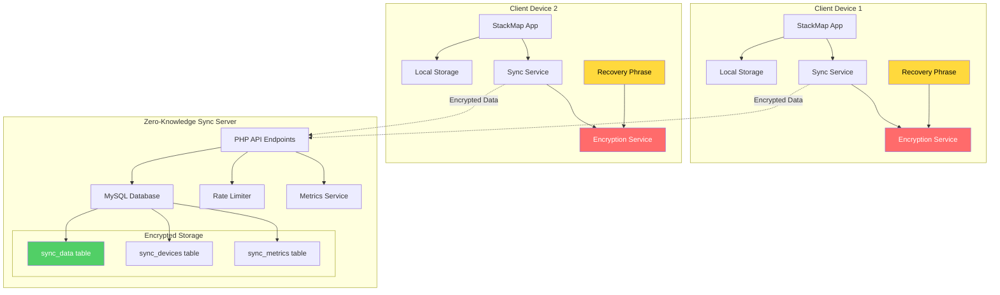
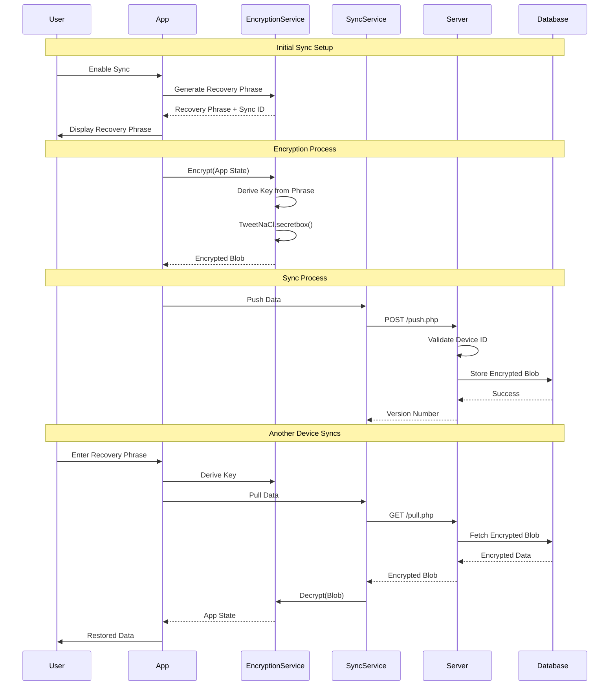
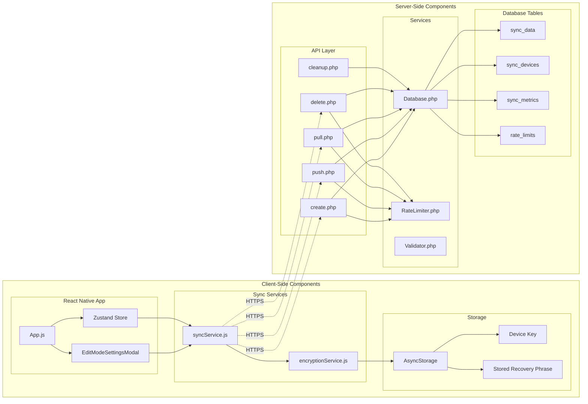
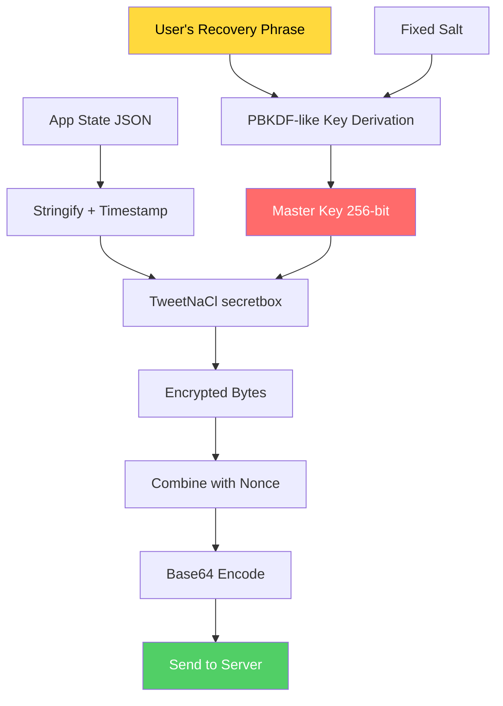
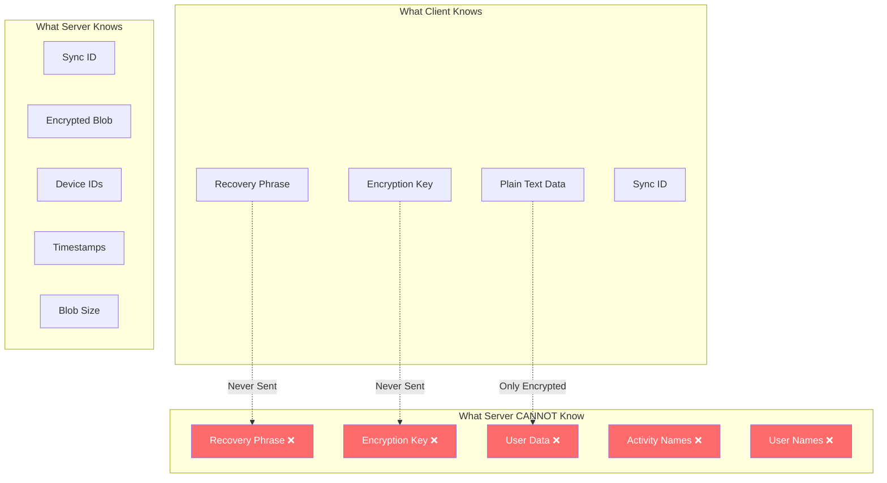
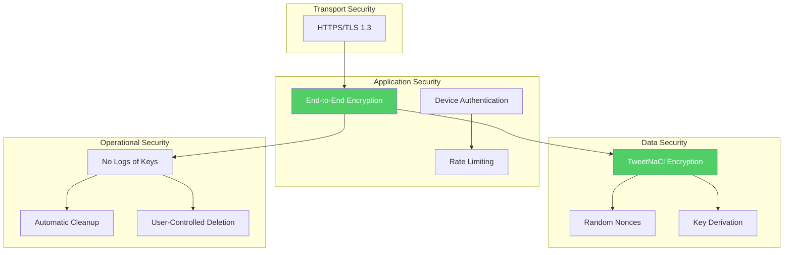

# StackMap Sync - Zero-Knowledge Architecture

## System Architecture Diagram

## Data Flow Diagram

## Component Architecture

## Encryption Flow

## Zero-Knowledge Properties

## Security Layers

## Key Components Summary

### Client-Side
- **TweetNaCl.js**: Provides secretbox encryption
- **Recovery Phrase**: User's only key (never sent to server)
- **Device Key**: For local recovery phrase storage
- **Sync Service**: Manages sync operations
- **Encryption Service**: Handles all crypto operations

### Server-Side
- **PHP API**: Simple REST endpoints
- **MySQL**: Stores only encrypted blobs
- **Rate Limiter**: Prevents abuse
- **No Key Storage**: Server never sees keys
- **Cascade Deletes**: Clean data removal

### Security Properties
- **Zero-Knowledge**: Server can't decrypt data
- **End-to-End**: Encryption happens on device
- **No Accounts**: No user credentials to leak
- **User Control**: Can delete everything
- **Forward Secrecy**: Each sync has unique nonce