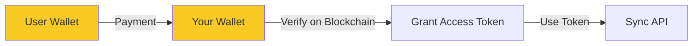

# Monetizing Zero-Knowledge Sync

## The Challenge

How to charge for sync while maintaining zero-knowledge properties:
- ✅ Accept payment
- ✅ Grant access to paying users
- ❌ Not link payment to specific data
- ❌ Not know which blob belongs to whom

## Solution Approaches

### 1. **Anonymous Access Tokens**

```mermaid
are
```

**Implementation:**
```php
// Payment creates token
$access_token = bin2hex(random_bytes(32));
// Store: token => expiry_date (not user info)

// Sync uses token
if (isValidToken($_POST['access_token'])) {
    // Allow sync operation
    // Still don't know who owns which blob
}
```

### 2. **Blind Signatures (Most Private)**

Uses cryptographic blind signatures:
1. User generates a random token
2. Payment system signs it "blindly"
3. User can redeem without revealing identity

**Similar to:** Digital cash systems, Privacy Pass

### 3. **Time-Based Access Codes**

```javascript
// User purchases access code
"SYNC-2024-ABCD-EFGH" // Valid for 1 year

// Multiple users could share (like Netflix)
// You don't know who uses which code for which data
```

### 4. **Cryptocurrency Payments**



- Bitcoin/Lightning Network for true anonymity
- Ethereum for smart contract automation
- Monero for maximum privacy

## Practical Implementation

### **Recommended: Token-Based System**

```php
// Database tables
CREATE TABLE access_tokens (
    token_hash VARCHAR(64) PRIMARY KEY,
    created_at TIMESTAMP,
    expires_at TIMESTAMP,
    sync_count INT DEFAULT 0,
    max_syncs INT DEFAULT NULL
);

// No user info, no blob association!
```

### **Payment Flow:**

1. **Stripe/PayPal Checkout**
   ```javascript
   // Client-side
   const { token } = await stripe.checkout({
       amount: 4.99,
       description: "StackMap Sync - 1 Year",
       // No user data required!
   });
   ```

2. **Server Generates Access Token**
   ```php
   function onPaymentSuccess($payment_id) {
       $token = generateSecureToken();
       storeToken($token, '+1 year');
       
       // Email or display token to user
       return $token;
   }
   ```

3. **User Adds Token to App**
   ```javascript
   // In StackMap settings
   const syncToken = prompt("Enter your sync access token:");
   await AsyncStorage.setItem('@sync_token', syncToken);
   ```

4. **Token Sent with Sync Requests**
   ```javascript
   fetch('/api/sync/push.php', {
       headers: {
           'X-Sync-Token': syncToken
       },
       body: encryptedData
   });
   ```

### **What You Know vs Don't Know:**

```
YOU KNOW:
✅ Token ABC was purchased on date X
✅ Token ABC has been used Y times
✅ Token ABC expires on date Z

YOU DON'T KNOW:
❌ Who purchased token ABC
❌ Which sync_id uses token ABC  
❌ Which encrypted blobs belong to token ABC
```

## Privacy-Preserving Features

### 1. **Token Sharing Allowed**
- Users could share tokens with family
- You can't tell who is using it
- Like sharing a Netflix password

### 2. **Multiple Tokens Per User**
- User could buy multiple tokens
- Use different tokens for different devices
- No way to link them together

### 3. **Rate Limiting Per Token**
```php
// Prevent abuse without identifying users
if ($token_usage > 1000_syncs_per_day) {
    // Probably shared too widely
    throttle();
}
```

## Pricing Models That Work

### 1. **Time-Based**
- $4.99/year access token
- Token works for any number of devices
- Simple and predictable

### 2. **Usage-Based**
- 1000 syncs for $2.99
- Token consumed as used
- Good for occasional users

### 3. **Freemium**
- Free: 100 syncs/month
- Paid: Unlimited
- Track by IP or sync_id (still anonymous)

## Real-World Examples

### **Mullvad VPN**
- Pay with cash, crypto, or card
- Get random account number
- No email, no personal info

### **ProtonMail**
- Can pay with Bitcoin
- Optional anonymous accounts
- Paid features without identity

### **Standard Notes**
- Extended features with license key
- Key not tied to identity
- Can pay anonymously

## Implementation Checklist

1. **Payment Processor**
   - [ ] Stripe/PayPal for cards
   - [ ] BTCPay Server for crypto
   - [ ] Generate tokens on success

2. **Token System**
   - [ ] Secure token generation
   - [ ] Expiry tracking
   - [ ] Rate limiting

3. **API Updates**
   ```php
   // Add to each endpoint
   $token = $_SERVER['HTTP_X_SYNC_TOKEN'] ?? '';
   if (!isValidToken($token)) {
       // Check if free tier limits exceeded
       if (exceedsFreeLimit($sync_id)) {
           http_response_code(402); // Payment Required
           echo json_encode(['error' => 'Sync limit reached']);
           exit;
       }
   }
   ```

4. **UI Updates**
   - [ ] Token input in settings
   - [ ] Purchase button/link
   - [ ] Usage counter display

## The Beautiful Part

This system means:
- ✅ You can monetize
- ✅ Users stay anonymous  
- ✅ Zero-knowledge maintained
- ✅ No GDPR concerns
- ✅ No data to subpoena
- ✅ True privacy-first business

You become like a "parking meter" - you take payment for time/space, but don't track who parks where!