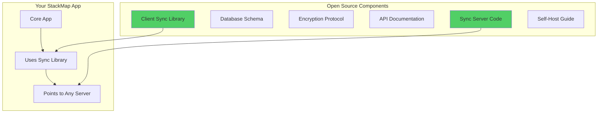
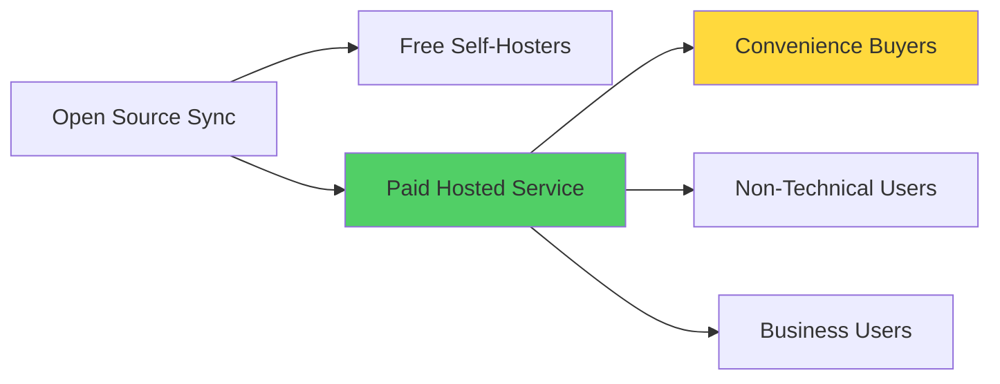

# StackMap Sync - Open Source Implementation Guide

## Overview

This guide explains how to self-host your own StackMap Sync server, giving you complete control over your data.

## What You Can Open Source



## Repository Structure

```
stackmap-sync/
├── server/                 # PHP sync server
│   ├── api/               # All PHP endpoints
│   ├── database/          # MySQL schemas
│   └── docker/            # Docker configuration
├── client/                # Client libraries
│   ├── js/               # JavaScript/React Native
│   │   ├── syncService.js
│   │   └── encryptionService.js
│   └── docs/             # Integration guides
├── docs/                  # Documentation
│   ├── API.md            # API reference
│   ├── ENCRYPTION.md     # Encryption details
│   └── SELF_HOST.md      # Self-hosting guide
├── examples/              # Example implementations
│   ├── minimal-server/    # Bare minimum PHP
│   └── docker-compose/    # Full stack example
└── LICENSE               # MIT or Apache 2.0
```

## Self-Hosting Options

### 1. **Basic PHP Hosting** (Like your current setup)
```bash
# Upload to any PHP host
1. Upload server/ contents to web host
2. Import database/schema.sql
3. Configure .env file
4. Point app to your server
```

### 2. **Docker Compose** (Easiest)
```yaml
# docker-compose.yml
version: '3.8'
services:
  web:
    build: ./server
    ports:
      - "8080:80"
    environment:
      - DB_HOST=db
      - DB_NAME=stackmap_sync
    
  db:
    image: mysql:8.0
    environment:
      - MYSQL_ROOT_PASSWORD=secure_password
      - MYSQL_DATABASE=stackmap_sync
    volumes:
      - ./data:/var/lib/mysql
```

### 3. **Serverless** (Modern approach)
```javascript
// Cloudflare Workers example
export default {
  async fetch(request, env) {
    const { SYNC_DB } = env; // D1 database
    
    if (request.method === 'POST') {
      return handlePush(request, SYNC_DB);
    }
    // ... other endpoints
  }
};
```

### 4. **Alternative Backends**

**Node.js/Express:**
```javascript
const express = require('express');
const sqlite3 = require('sqlite3');
const app = express();

app.post('/api/sync/push', async (req, res) => {
  // Same logic, different language
});
```

**Rust/Actix:**
```rust
#[post("/api/sync/push")]
async fn push_sync(data: web::Json<SyncData>) -> Result<HttpResponse> {
    // High performance option
}
```

## Making It User-Friendly

### 1. **One-Click Deploy Options**

```markdown
## Quick Deploy Options

[](https://vercel.com/new/clone?repository-url=https://github.com/you/stackmap-sync)

[](https://railway.app/new/template/stackmap-sync)

[](https://heroku.com/deploy?template=https://github.com/you/stackmap-sync)
```

### 2. **Simple Configuration**

```javascript
// In StackMap app
const SyncSettings = {
  // Default to your server
  defaultServer: 'https://sync.stackmap.app',
  
  // Allow custom server
  customServer: AsyncStorage.getItem('@custom_sync_server'),
  
  // Easy switching
  servers: [
    { name: 'Official', url: 'https://sync.stackmap.app' },
    { name: 'Self-Hosted', url: 'custom' },
    { name: 'Local', url: 'http://localhost:8080' }
  ]
};
```

### 3. **GUI for Server Selection**

```javascript
const ServerConfig = () => (
  <View>
    <Text>Sync Server</Text>
    <Picker
      selectedValue={syncServer}
      onValueChange={setSyncServer}
    >
      <Picker.Item label="StackMap Official" value="official" />
      <Picker.Item label="Custom Server" value="custom" />
    </Picker>
    
    {syncServer === 'custom' && (
      <TextInput
        placeholder="https://your-server.com/api/sync"
        value={customUrl}
        onChangeText={setCustomUrl}
      />
    )}
  </View>
);
```

## Documentation Structure

### For Developers:
```markdown
# API Documentation

## Push Endpoint
POST /api/sync/push

Headers:
- Content-Type: application/json

Body:
{
  "sync_id": "string",
  "device_id": "string", 
  "encrypted_blob": "base64 string"
}

Response:
{
  "success": true,
  "version": 1
}
```

### For Users:
```markdown
# Self-Hosting Guide

## Why Self-Host?
- Complete control over your data
- No dependency on our servers
- Can modify for your needs

## Requirements
- PHP 7.4+ hosting OR
- Docker OR  
- Any server that can run the sync protocol

## 5-Minute Setup
1. Click "Deploy to Vercel" button
2. Create free Vercel account
3. Add database (free tier)
4. Copy your server URL
5. Paste in StackMap settings
```

## Benefits of Open Sourcing

### For Users:
- ✅ **Trust**: Can verify zero-knowledge claims
- ✅ **Control**: Host their own data
- ✅ **Permanence**: Service can't disappear
- ✅ **Freedom**: Not locked into your servers

### For You:
- ✅ **Community**: Contributors can improve code
- ✅ **Trust**: Major selling point
- ✅ **Reduced Liability**: Users can self-host
- ✅ **Innovation**: Others might build cool features

## Example Projects Doing This Well

1. **Bitwarden**
   - Offers cloud service
   - Fully open source
   - Easy self-host options
   - Thriving community

2. **Nextcloud**
   - Commercial support available
   - Completely open source
   - Many hosting providers

3. **Joplin** (Note-taking)
   - Open source clients
   - Open source sync server
   - Can use Dropbox/WebDAV/S3

## Monetization Still Works!



Most users will pay for convenience:
- Don't want to manage servers
- Trust your uptime
- Automatic updates
- Support included

## Implementation Checklist

- [ ] Clean up code for public release
- [ ] Add clear LICENSE file
- [ ] Write comprehensive README
- [ ] Create Docker containers
- [ ] Add one-click deploy buttons
- [ ] Document API thoroughly
- [ ] Add server selection to app
- [ ] Create migration tools
- [ ] Set up CI/CD for releases
- [ ] Create community Discord/Forum

The beauty: Users get choice and control, you get trust and community, everyone wins!